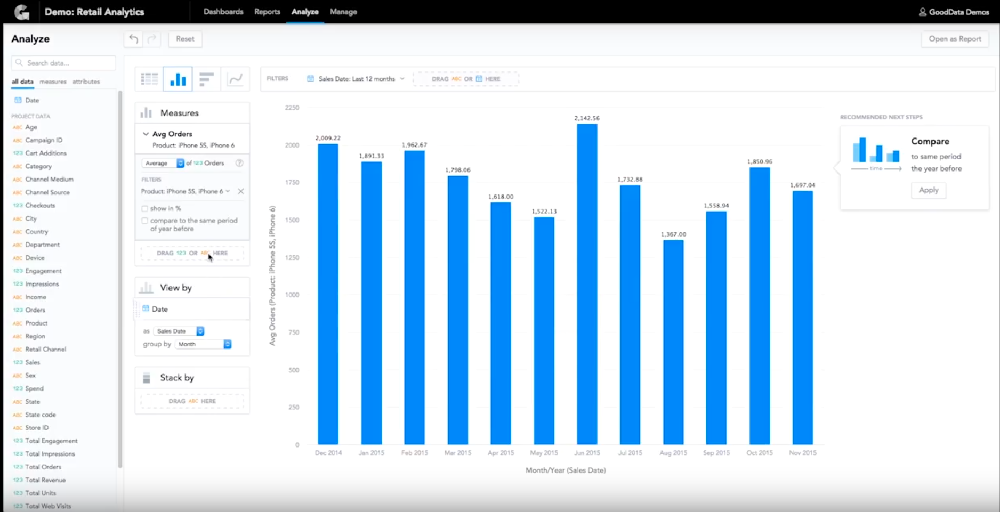

[返回文档目录](../)

# Business Intelligence software
>商业智能软件

Business Intelligence Software (or BI software) is a class of computer applications that process and analyze corporate data to produce quality insights, and help understand the health of your business. BI software uses a variety of formulas and metrics to measure, compare, and relate business indicators, and makes it possible to distinguish the strengths and weaknesses of every company. The main functions of these systems are data discovery, data management, and reporting, but some of them also evaluate functionality and employees’ performance.
>处理分析企业数据，转化为洞察，帮助明白业务是否健康。BI软件使用多样的方法和维度去测量、对比、管理商业指标，从而判断每个公司的优势和劣势。主要功能包括：发现数据、管理数据、和数据报告，还有些产品会衡量功能性和员工绩效。

The goal of business intelligence programs is to allow for the easy and deeper interpretation of large volumes of business data. Finding out opportunities to grow and adopting effective strategies based on these deep, analytical insights can provide businesses a huge competitive market edge over competitors, aside from long-term stability.

## Targeted Businesses
**Departmental buyers and business users:** These buyers opt for small data-discovery apps and BI tools over big BI systems. They look for ease-of-use and fast deployment, and do not worry much about robust functionality and integration. These are normally business users and not IT staff.

**IT buyers:** These are traditional buyers who look for in-depth functionality and integration with the other business apps they use. For these buyers, integration across different units and entities is more vital than ease of use.

## Type of Business Intelligence Software

Business intelligence programs can be deployed in different ways. These include:

* On-premise deployment: In-house product installation using equipment owned or leased by the company. The advantage is you are assured of data security.

* Cloud implementation: Public cloud, private cloud, or a hybrid cloud. The benefits are you don’t have to download any software, or worry about upgrades and maintenance.

* Data Management Tools
Include the following features:

  * Data quality management –  Helps companies maintain clean, error-free, and standardized data. Standardization is essential for BI implementations that include data from multiple sources.
  * Extract, transform and load (ETL) – Gathers data from outside sources, changes it, and then loads it into the target system (a warehouse or database).

* Data Discovery Applications
List of features includes:

  * Data mining – Sifts through vast amounts of data to identify new patterns.
  * Online analytical processing (OLAP) – Enables users to speedily evaluate multidimensional data from various perspectives.
  * Predictive analytics – Evaluates current and historical data to make forecasts about future opportunities and risks.
  * Semantic and text analytics – Extracts and interprets huge volumes of text to spot patterns, sentiment, and relationships.

* Reporting Tools
Features include:

  * Visualizations – Helps users create sophisticated graphical representations of data using simple user interfaces.
  * Dashboards – Dashboards highlight key performance indicators (KPIs) that help managers focus on important metrics.
  * Report writers – Allows users to design and create custom reports.
  * Scorecarding – Scorecards give a numerical weight to performance and help to map progress towards objectives.

## Key Features of Business Intelligence Software

The most typical features of a business intelligence program include:

* Experimenting to look at previous decisions (A/B testing or multivariate testing)
* Forecasting future business results (predictive modeling or predictive analytics)
* Extrapolating business data to see new patterns and relationships (data mining)
* Explaining the causes why a result or outcome has happened (statistical analysis or quantitative analysis)

### Data Management
A major consideration when selecting business intelligence programs is to check how capable a tool is in giving complex business data relevant meaning and context for your business to understand the entire situation. It means the tool you should choose should be able to make the raw and unstructured business data “analytic-ready” with its data manipulation, extraction, query, as well as business logic features.

### Reporting
When choosing business intelligence, check out their reporting features as claimed by the solution’s vendor or provider. Can the tool really create and distribute business data in visually informative charts, tables, and in a specified or desired page layout. Can the tool also provide you with not just fundamental reporting but even advanced and more meaningful reporting and presentation features?

Features such as associative relationship displays, three dimensional images, and pivot-like, easy-to-configure interfaces should be some of the top considerations in your mind. Do these features show up on a mobile platform, particularly when you are showing these data outside your work?

### Architecture
Does the business intelligence tool support scalable methods for diverse and complex data sets? For instance, if your business has a huge number of data sets that are at the same time complicated, you might consider buying a program that can effectively handle them and scales to large numbers of data sets.

Check if the tool is designed using a single code base or if it offers solutions compiled from various products that are developed independently. Check if the tool has a quick development cycle, provides your business tightly integrated solutions, and offers amazing user experience.

Can the tool be embedded with the information technology systems you are already using? Does it provide you with solid data security? Can the tool restrict business data view and functionality to a select number of users or user groups?

Does the tool provide you with consistent data backups? If it isn’t, then your business data might get leaked or lost when serious technical glitches happen.

## Benefits of BI Software
### Ability to integrate information from different business systems
Strategic business insight generally needs data across various systems. For example, operational results of your company will need a financial perspective. Therefore, your business intelligence software solution should have the capacity to quickly and dynamically integrate information from different sources so you will get answers to a number of business questions.

### Outstanding reporting and analysis
When looking at programs, always remember that the solution should offer you more knowledge about complex trends and views in your company. Do not stick with a business intelligence software application that can merely report the business data it mined. You should look for a tool that offers you an explorable capacity, letting you to understand different actions or strategies you can take to predict different scenarios and look for the best ways to achieve success.

### Historical analysis and reporting
Ideally, the business intelligence program you should invest in is one that will be able to give you a deeper insight into the company’s overall performance over time and the causes for that positive (or negative) performance. Successful decision-making, in general, needs to have a thorough and critical understanding of the growth of your company over the years and the reasons behind it. In short, your program should have the capacity to map and analyze historical data that may be complex over time, even years. This means you should also get a tool that has the capacity to extract, manipulate, and understand possibly a lot of information. In a lot of companies, millions of database entries are a normal thing.

### Future projection and forecasting
The tool’s capacity to analyze and report historical data enables you to project business findings into the future. It will enable you to look at present opportunities and forecast the next possible steps for your company. The ability to forecast and project scenarios in the future should always be among your top factors when it comes to success.

## Sisense
Sisense is a business intelligence platform that lets users join, analyze, and picture out information they require to make better and more intelligent business decisions and craft out workable plans and strategies.

With Sisense, users can unify all the data they ever need and want into visually appealing dashboards via a drag and drop user interface. Sisense basically allows users to turn data into highly valuable insights and then share them with colleagues, business partners, and clients  via interactive dashboards.

### Advantages

* Gather all your information from all your sources and unify them into a single, accessible repository.
* Produce rich and intelligent analysis using robust visual reports without going through the hassle of preparation.
* Easily share your insights with your team, partners, and clients.
* Easy to use interface allows non-techies to quickly adapt and get acquainted with the system.
* Very fast system as it maximizes the potential of 64-bit computer, multi-core CPUs and parallelization capabilities.

## GoodData

GoodData is a company that believes that data is for everyone, and everyone should therefore be able to base business decisions on actionable information. When people are given access to relevant data, GoodData believes, they will innovate and grow their business, but most of all get to know the customers they are working with.

GoodData goes beyond business intelligence to provide high value insights as a service. It provides advanced analytics for driven companies to create new revenue streams. Its strength is helping marketers and independent software vendors understand their clients’ behavior and needs.

It is a comprehensive cloud analytics tool that integrates cloud data with your operational sources to quickly uncover, among others: customer insights that reflect your marketing’s impact on the business; operational insights that can improve decision making efficiency as well as increase sales velocity; and opportunities to get new revenue streams with the help of embedded analytics.

GoodData offers Insights as a Service with a cloud analytics platform that integrates cloud data with on-premise data sources to uncover:

* Customer Insights that measure Marketing’s impact on the business
* Operational Insights that improve decision-making efficiency
* Opportunities to generate new revenue streams through embedded analytics
* Because many solutions do not handle the entire data pipeline – from integration, through ETL, analytics and visualization – it is extremely difficult for the business users and analysts to be self-sufficient and answer new questions.
* Data Explorer allows IT teams to be proactive and continuously set up new sources of data for analysts. This allows analysts to be more productive and turn around insights with new sources of data in minutes.
* Analytical Designer not only guides the analyst to better insights with our best practices and recommendations, but also enables the business user to do their own discovery. GoodData leverages Collective Learning across its extensive multi-tenant cloud environment to enhance productivity.
* Email Sharing and Collaboration make it easy to tailor and share the insights discovered within GoodData with all key stakeholders across the organization.
* GoodData’s Data Pipeline with the Agile Data Warehousing Service is what makes all of this possible. Data analysts maintain ownership of source systems and visibility of data lineage through the entire pipeline. Flexible workspace management enables decentralized analyst productivity while maintaining centralized production level environment control.

### Features
* Guiding, interactive interface
* Interactive dashboards
* Predictive search and filtering function
* Open to 3rd party layers like Power BI, Tableau or R
* Custom branding / color palettes
* Cross-customer benchmarking
* Templates such as Sales, Marketing, and Service Analytics
* Real-time access anytime, anywhere
* Pre-built analytic packages
* Programmatic support for Ruby, Java, JavaScript.
* Insights at the blink of an eye.
* Cloud analytics never looked so good.
* GoodData pre-built connectors and APIs
* Agile Data Warehousing Service
* 3rd Party Integration Service
* Extensible Analytics Engine (XAE)
* Multi Dimensional ROLAP cubes
* Logical Data Modeling functions
* Library of statistical functions and features
* Ad-hoc reporting
* Dynamic charts and graphs
* Extensible through full SDK

### Solving Problems
360 customer view – Most companies struggle to understand the 360 customer view. Dave, VP Marketing, is overwhelmed with data overload from 20 sources, and is challenged to personalize customer experience. Working with multiple Excel files has made it difficult to trust the source of truth. GoodData connects multiple data sources to provide holistic customer insights and enhance productivity with approved data and earlier IT involvement. With GoodData, Dave can focus on helping sales and marketing teams improve operational efficiencies and develop customer insights by analyzing buyer journeys, especially through digital channels.

Actionable insights – Annie, the Sales Director, needs actionable insights and not just reports or dashboards. She has a meeting with the executive team in half hour and needs to deliver sales forecast for the quarter and challenging opportunities. GoodData supports advanced statistical functions such as regression, trendline, time series forecasting, outlier analysis and more to forecast sales and predict anomalies, what-if scenarios and affinity analysis. Now, with a few clicks, Annie can share sales trends, forecast and top performing opportunities.

Data discovery – Bob, the Business Analyst, has created dashboards to view KPIs and quarterly trends. He just received a request from the Executive team to run adhoc analysis on why sales had reduced in the last quarter and share the update in an hour. GoodData’s Analytical Designer not only guides the analyst to better insights with our best practices and recommendations, but also enables data discovery to get a deep-dive on the trends. GoodData’s insights network expands with collective learning from millions of user interactions.

## Periscope - Cloud Based Solution

### Abouts:

Periscope Data is a comprehensive data analysis platform. It is a good tool that brings to you all the relevant and important parameters at one place which gives you a complete view of your business operations and their results. Automatically, it enables you with better decision making for your business.

At the same time, Periscope Data helps you visualize some of the key aspects of your business. Highly interactive and intuitive graphic displays accompanied by filters can be a big help to check out how you can bring about improvements in your business decisions.

To help you address to different types of queries more efficiently, Periscope Data features the Ad-Hoc Query tool. This tool is designed so that you can handle some of the most complex data analysis without any hassle. You can create data models and do much more through this query tool.

Another good thing about this software is that all your team can access it without any additional charges. There is no limit to member access which helps you to keep all your team members in loop and updated. Another advantage of this unlimited access is that transparency is maintained across all your departments so there are lesser chances of mistakes.

### Comments:

Periscope helps to generate or create visual chart and graphs for presentation to the sales team. You do not have to be an expert programmer to make the best use of this tool. You can learn how to code using the learning sessions and free tutorials at your disposal. The idea is to be able to customize those graphs and charts such that you get the results you need and it becomes easy when you are presenting the results. Also, you can export files from excel spreadsheets so that you can analyze them and present them into a report in the form of graphs or charts for easy understanding.

For those who have little or no knowledge in programming, the learning curve is real. It will take you a long time to figure out some of the features and how they are utilized to give you the results or experience you want. The user interface can be complex when you are getting started but you figure it out with time. There is a security protocol which you have to follow once you generate your chart, which entails locking them. If you do not undertake this procedure, anyone can tamper with your charts. You thus have to figure out how to lock them and, at first, I could not hack this.

Since I deal with procurement and supply chain management, I need to know which product is doing better and the one which is not up to standard. With this tool, I am able to achieve this with ease. I can view the sales pattern and how a specific product is responding to the market and decide on the best way forward. For example, if a product is performing better, I know that I am doing something right. However, if a product is not doing well, I can put more attention to get it back on track. On top of that, I can help out other group members by providing them with charts so that they can keep track of the key performance indicators for better decision making.

### Features:

Data Access Control
Database Joints
CSV files import
Data Mining
Automatic Cache Data
Advanced SQL Editor
Quick Chart Creation
Pivot Tables
Dashboards
Custom Filters
Email Reports
Sharing
Collaboration
