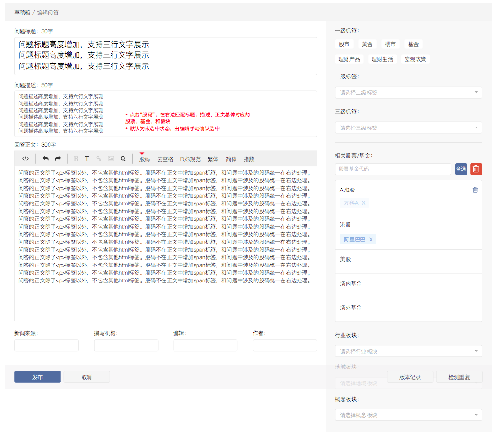
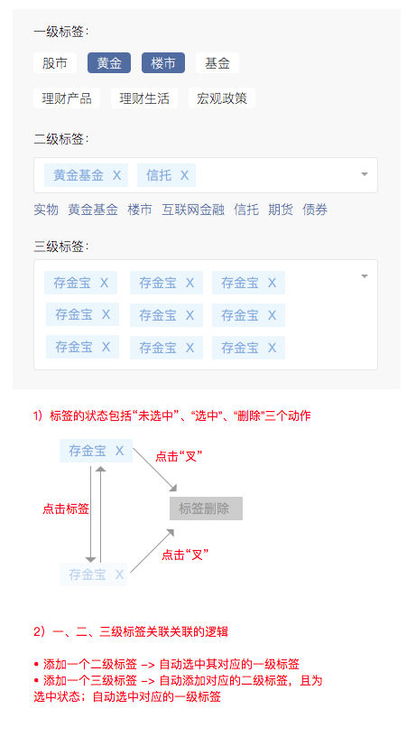
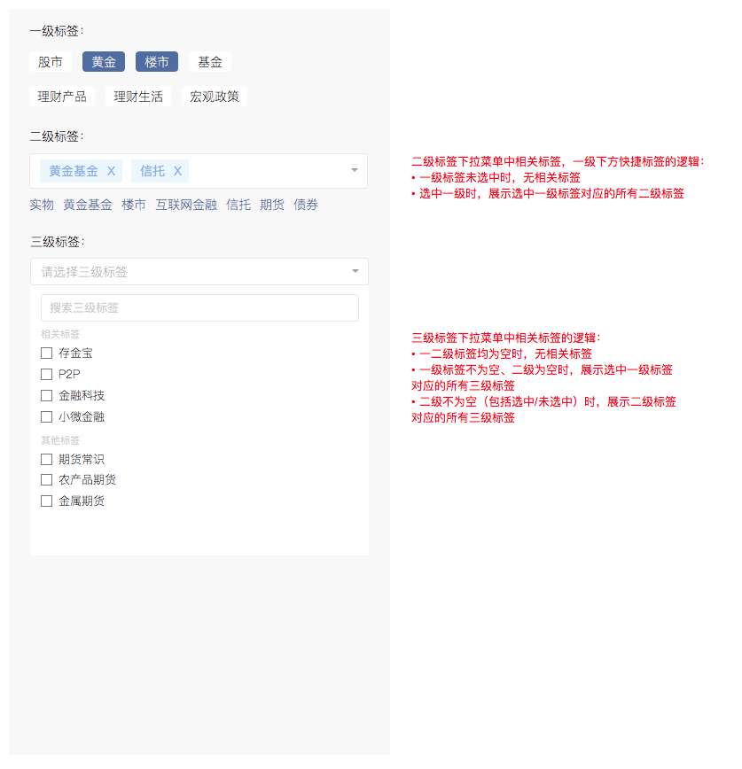

[返回文档目录](../)

# 聚宝问答模块后台

## 目录
1. [字段说明](#1-字段说明)  
    1.1 [数据字典](#11-数据字典)  
    1.2 [传输字段修改说明](#12-传输字段修改说明)  
2. [聚宝合作流程及注意事项](#2-聚宝合作流程及注意事项)  
    2.1 [技术流程](#21-技术流程)  
    2.2 [问答处理流程](#22-问答处理流程)  
    2.3 [运营抽检和复核机制](#23-运营抽检和复核机制)  
3. [Invest后台操作流程](#3-invest后台操作流程)  
4. [Invest对应改造内容](#4-invest对应改造内容)  
    4.1 [功能概览](#41-功能概览)  
    4.2 [界面原型](#43-界面原型)  
    4.3 [未来可能需要注意的事项](#42-未来可能需要注意的事项)  

## 1. 字段说明

### 1.1 数据字典

| 一财字段名 | 业务含义 | 一财改造 |
|:---:| :-----------: | :-----------: |
| title | 问题标题，为空时填“待补充” | 最多支持1000个字，可由编辑修改 |
| summary | 问题描述，为空时不填 | 最多支持4000个字，可由编辑修改 |
| content | 回答，为空时填“待补充” | 最多支持10000个字，可由编辑修改 |
| source_id | 问答对的唯一id |  |
| origin_url | 问题的唯一id |  |
| origin_date | 数据清洗或传输给一财的时间，仅填充required字段，不一定作为导入时的发帖时间 |  |
| compose_organization | 标记外部或内部来源，外部爬取标记，如深圳交易所互动易、内部优质观点转问答 |  |
| origin_website | 稿件处理类型：待清洗问答、待补充问题、待回答 |  |
| stock_codes | 对应产品id，如000001.SZ或000001.OF，与资讯相同，类型为array | 可由编辑修改 |
| tags | 业务标，类型为array | 可由编辑修改  |
| keywords | 补充标（算法标，类型为array） | 可由编辑修改 |
| options | map类型的扩展字段 | 需新增该字段 |  

> 备注：问答类型文件在稿库中可通过渠道“聚宝问答”来区分  

> 备注：content中的`\n`会处理成`

`后再传给一财，原社区数据中`{{T_0}}`等占位符会删除；content中除了`
`标签外，不会包含其他html标签。

### 1.2 传输字段修改说明：

1. title对应问题（最多1000个字符）
2. summary对应问题描述（最多4000个字符）
3. content对应回答（最多10000个字符，回答中会统一处理成`

`后再传给一财），标签的3个字段待定，需新增一个map类型的扩展字段（不需要一财修改）

## 2. 聚宝合作流程及注意事项

### 2.1 技术流程：

1. 数据同学负责汇总所有来源数据（爬取、内部整理），清洗后，写入mysql表中
2. 聚宝服务端读取mysql表将数据post 一财的http接口
3. 一财打标完成后将数据post 聚宝服务端提供的http接口
4. 聚宝服务端导入问答库

> 注：导入数据包括以下4部分：
> 1. 爬虫内容
> 2. 基金公司内容------大概会涉及1500只基金，对应35家基金公司
> 3. 结构化内容处理-----覆盖长尾基金和股票
> 4. 历史内容转问答----按问题+commetid格式，部分内容已完成问题编写，部分内容需一财同学协助处理
> 5. 第2、3、4部分数据由聚宝运营同学离线提供，由聚宝数据同学统一处理成约定格式，写入流程1中的mysql/hbase表中

### 2.2 问答处理流程

1. `一问一答`作为一条数据传输，如果原始问答中一条问题有多个回答，则拆成一问一答多条数据传输。
2. `一问一答`作为一个整体打标，打标要综合考虑问和答的内容。
3. 一条数据中可能缺失问或者答，当缺失时，在稿件来源字段中标记，需要一财同学根据未缺失部分补充缺失的问或者答。
4. 一财同学需要做的事情：补充缺失的问或答、对问答文字修改美化、对问答综合打标。

> 注：打标内容包括
> 1. 股码
> 2. 业务标：规划有圆桌对应的标签（如事件标、行业标、一级大类标签）
> 3. 补充标（算法标）：除业务标外其他标签，如二级、三级细化标签。

### 2.3 运营抽检和复核机制

一财回传数据入库后，由数据同学定时分发抽检数据，交由运营评估。发现错误的告知一财修改，并再次回传更新数据；发现大量错误时由运营发起应急机制，可采取`暂停打标`、`重新沟通`等措施。

> 注：`业务标`和`补充标`由运营同学指定。 三部分标签按三个字段回传给聚宝服务端，聚宝服务端对于`补充标`标签单独存储。

## 3. Invest后台操作流程
1. 问答文件进入稿库
2. 编辑从稿库筛选处理问答，或使用急速发稿功能批量处理稿件
3. 编辑检测重复，问答标题、摘要、正文，匹配对应标签，发布或弃用问答
4. 对已发布的问答，编辑可做更新和下线操作

## 4. Invest对应改造内容
### 4.1 功能概览
1. 待处理问答列表（稿库） - 问答文件入库进目前的稿库，可通过筛选渠道或来源过滤出问答稿件，编辑稿件时进入新开发的问答编辑界面
2. 问答编辑页面（编辑器） - 第一期除了`
`标签用于分段以外，问答内容不包含其他html标签，所以原编辑器中的加粗、超链接、插入图片功能可暂时禁用；同时打股码功能与之前略有不同，需要匹配问题标题、问题描述、正文三者中总体的股码对应情况；
3. 问答编辑页面（标签） - 业务标：根据聚宝新标签体系，开发新的标签选择界面及交互；股票基金板块标签：沿用之前稿件编辑对应组件
4. 问答审核列表（栏目审核） - 已处理问答进入栏目审核列表中，可通过筛选稿件类型过滤出问答稿件

### 4.2 界面原型
1.问答编辑页面  

2.标签点选交互  

3.标签下拉列表  

### 4.3 未来可能需要注意的事项
1. 去重检测：目前去重检测包括标题和正文的检测。对于问答类型文件，考虑增加“相同问题”的检测（通过origin_url）。同时对于标题和正文检测，建议排除相同问题。
2. 编辑界面升级：目前弹窗式的去重检测提醒，由于遮挡了编辑框，影响编辑效率，可能需要做对应的优化。
