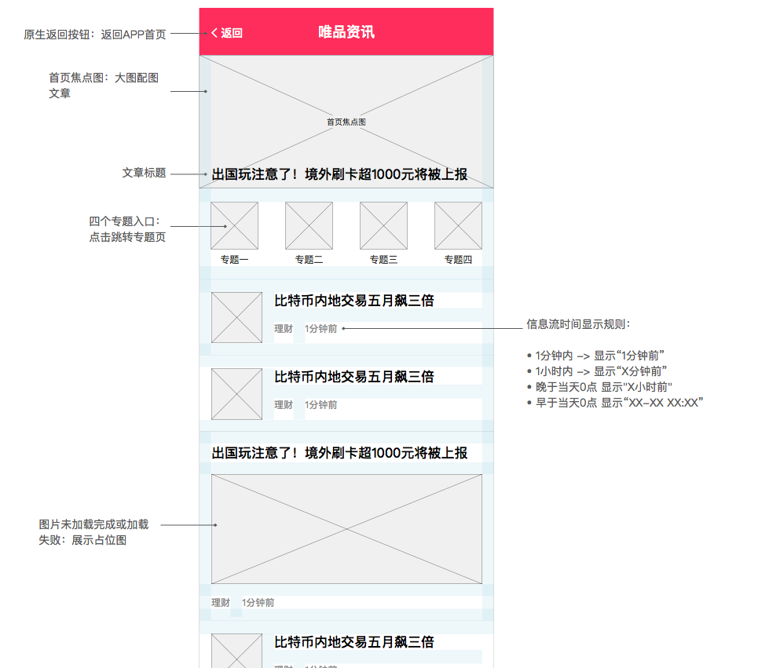

[返回文档目录](../)

## 绝对值资讯流-唯品会

首页头条、资讯H5、统计需要

### 首页头条推送

* 字段包括：

|字段|字段名称|字段类型|说明|
|:---:| :-----------: | :-----------: | :----------- |
|apikey|密钥|String||
|reqTime|请求unix时间戳|String||
|status|操作类型|String|0-发布/更新；1-下线|
|tipsId|文章id|String||
|title|标题|String||
|label|标签|String||
|imgUrl|图片链接|String|唯品会直接使用，不下载转存|
|targetUrl|目标链接|String|文章url，注意推入头条文章浏览量的统计需求|

&emsp;&emsp;  

* 内容范围（测试阶段）：

新闻来源为“第一财经｜CBN”，且专题不包括: 回音谷 聚宝定制 社区内容，且配图不为空。

### H5资讯页

#### 结构概述

H5资讯页分三个页面：首页、专题页、资讯详情页。

以 web view 方式嵌入唯品金融APP，资讯页主要负责页面内容展示及点击页面元素后的链接跳转。顶部的导航（返回）、页面失败、下拉刷新均由APP处理。

#### 首页

* 内容填充

  * 网页标题: “唯品资讯” ，APP取到后作为导航栏标题。  
  * 焦点图：文章列表（一篇文章）取  `wph_banner` 接口。  
  * 四个专题入口：icon待替换，文章列表取 `wph_1`、`wph_2`、`wph_3`、`wph_4` 接口。  
  * 首页文章信息流：取 `wph_main` 接口。  
  * 配图支持类型：只支持 p1、p3 类型配图，分别展示为小图、大图样式，遇到其他配图类型以无配图样式处理。（无配图设计稿待补充）
  * 配图未加载完成或加载失败：展示占位图。（设计稿待补充）  

* 原型

  

### 统计需求

### 附录1：唯品头条接口情况

#### 实施方案
1. 采用实时接口的方式，一财直接调用。
2. 采用restful的方式。
3. 目前没有测试环境（测试环境内网无法访问），提供线上环境直接调用（调试阶段会返回后端接收到的文本信息，完成后没有配置信息返回）。
4. 接口通讯协议支持HTTPS短连接的通讯协议。消息内容以JSON字符串的方式进行传输。

#### 接口信息

|信息|描述|
|:---:| :----------- |
|URL| https://jr-api.vip.com/common/tips |
|请求类型|POST|

#### 白名单
目标链接和图片链接需要确定域名 ，只有域名正确才会接收；需要提供请求的白名单ip；传入时需要传入apikey，然后通过apisercret加密，加密后放入头文件中。

#### 加签规则
1. 必须在请求参数中加入reqTime，单位秒。与服务器时间相差在1分钟内有效
2. 将所有请求参数按parameter name的字母顺序排列，再concatenate所有parameter value，生成text A
3. Concatenate  text A and API secret ，生成text B
4. 对text B做Md5，生成API signature
5. 生成的API signature不再通过URL传输，而是通过HTTP Authorization header传输，格式示例为:
Authorization: OAuth api_sign=9e50918172ecc240ec76eca88be694ed

举例：

```
api_key = 24415b921531551cb2ba756b885ce783&c=yyy&b=xxx&d=zzz&reqTime=137131201  
api_secret = 123

text A = 24415b921531551cb2ba756b885ce783xxxyyyzzz137131201  
text B = 24415b921531551cb2ba756b885ce783xxxyyyzzz137131201123  
signature = Md5(text B)   = 9e50918172ecc240ec76eca88be694ed  
key = 80008000001  
secret = 1c27bf30a5b149ff81bc3eddd5a4db4a  
```

#### 返回参数

|参数名称|参数命名|类型|备注|可空|
|:---:| :-----------: | :-----------: | :----------- |:-----------: |
|状态码|success|boolean|success-成功；failure-失败|Y|
|返回码|resultCode|String(10)|都可以转换为数字|Y|
|信息|message|String(100)|返回提示|Y|
|返回数据|results|JSON|返回参数，包括请求协议参数|Y|

&emsp;&emsp;  

|返回|描述|
|:---:| :----------- |
|200| 正常 |
|22001| 缺少参数 |
|5000|网络繁忙|

> 注：当前版本会显示上传成功的资讯列表，以后不显示

#### 返回示例

```
  {
  
    "resultCode": "200",  
    "results": {  
    },
  
    "message": "tips上传成功",  
    "success": true
  
  }
```  
