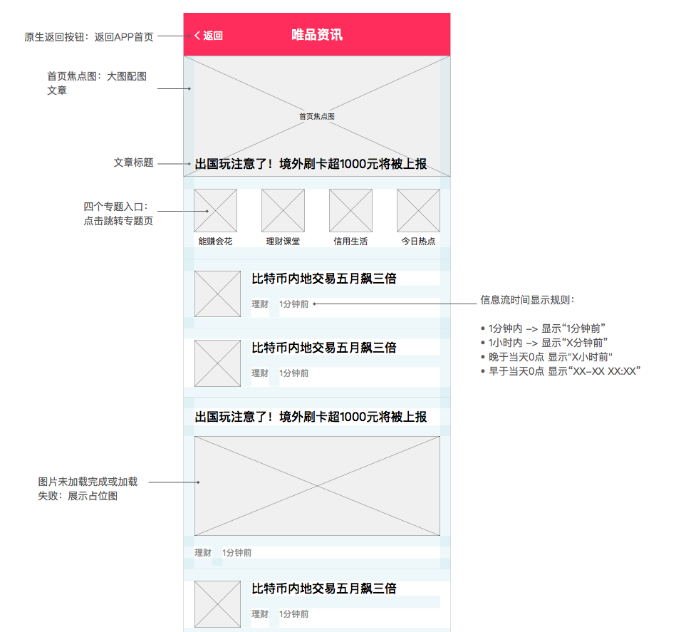
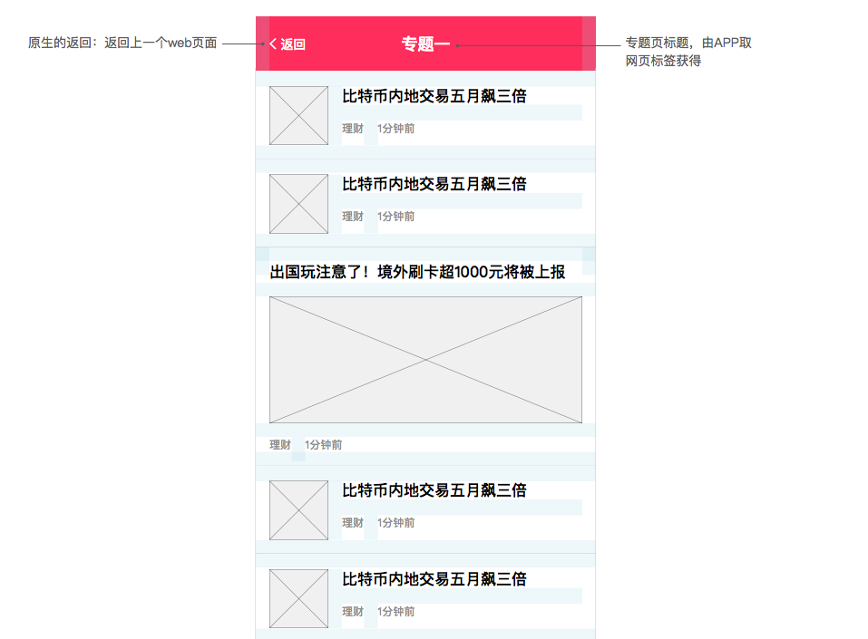

[返回文档目录](../)

## 绝对值资讯流-唯品会

### 目录

* [1. 首页头条推送](#1-首页头条推送)
* [2. H5资讯页](#2-h5资讯页)
  * [2.0 结构概述](#20-结构概述)
  * [2.1 首页](#21-首页)
  * [2.2 专题页](#22-专题页)
  * [2.3 文章详情](#23-文章详情)
* [3. 统计需求](#3-统计需求)
  * [3.1 统计工具](#31-统计工具)
  * [3.2 产品指标统计需求](#32-产品指标统计需求)
  * [3.3 运营指标统计需求](#33-运营指标统计需求)
* [4. 附录1：唯品头条接口情况](#4-附录1唯品头条接口情况)

### 1. 首页头条推送

* 字段包括：

|字段|字段名称|字段类型|说明|
|:---:| :-----------: | :-----------: | :----------- |
|apikey|密钥|String||
|reqTime|请求unix时间戳|String||
|status|操作类型|String|0-发布/更新；1-下线|
|tipsId|文章id|String||
|title|标题|String||
|label|标签|String||
|imgUrl|图片链接|String|唯品会直接使用，不下载转存|
|targetUrl|目标链接|String|文章url，注意推入头条文章浏览量的统计需求|

&emsp;&emsp;  

* 内容范围（测试阶段）：

  栏目为要闻或基金；配图不为空；新闻来源为“第一财经｜CBN”，且专题不包括: 回音谷、聚宝定制、社区内容。

### 2. H5资讯页

#### 2.0 结构概述

H5资讯页分三个页面：首页、专题页、资讯详情页。

以 web view 方式嵌入唯品金融APP，资讯页主要负责页面内容展示及点击页面元素后的链接跳转。顶部的导航（返回）、页面失败、下拉刷新均由APP处理。

> 注：目前页面正常加载也会报404，需要看具体的错误信息，这个对接时需要和唯品会技术同步下。

测试阶段焦点图、首页信息流、专题列表、标签规则如下：

|元素|接口|范围或规则|
|:---:| :-----------: | :----------- |
|首页焦点图|wph_banner|首页信息流的第一篇大图配图文章|
|首页信息流|wph_main|排除首页焦点图；栏目为要闻或基金；新闻来源为“第一财经｜CBN”，且专题不包括: 回音谷、聚宝定制、社区内容|
|能赚会花（专题）|wph_1|栏目为要闻或基金；新闻来源为“第一财经｜CBN”，且专题不包括: 回音谷、聚宝定制、社区内容|
|理财课堂（专题）|wph_2|同上|
|信用生活（专题）|wph_3|同上|
|今日热点（专题）|wph_4|同上|
|文章标签||栏目的第一个|

#### 2.1 首页

* 内容填充

|区块|内容元素|说明|
|:---:| :-----------: | :----------- |
|网页标题|文本：唯品资讯|APP取到后作为导航栏标题|
|焦点图|背景、标题|wph_banner 接口，为焦点图对应文章|
|专题入口|专题icon（待替换）、专题文案|专题文案依次为 能赚会花、理财课堂、信用生活、今日热点|
|首页信息流|文章列表；文章元素包括标题、配图、标签、发布时间|只支持 p1、p3 类型配图，分别展示为小图、大图样式，遇到其他配图类型以无配图样式处理。（无配图设计稿待补充）|

&emsp;&emsp;  

> 注：配图未加载完成或加载失败,展示占位图。（设计稿待补充）

&emsp;&emsp;  

* 原型

  

#### 2.2 专题页

* 内容填充

|区块|内容元素|说明|
|:---:| :-----------: | :----------- |
|网页标题|文本：专题名称（能赚会花、理财课堂、信用生活、今日热点）| APP取到后作为导航栏标题 |
|文章列表|文章元素包括标题、配图、标签、发布时间|只支持 p1、p3 类型配图，分别展示为小图、大图样式，遇到其他配图类型以无配图样式处理。（无配图设计稿待补充）|

&emsp;&emsp;  

> 注：配图未加载完成或加载失败,展示占位图。（设计稿待补充）

&emsp;&emsp;  

* 原型

  

#### 2.3 文章详情

* 内容填充

|内容元素|说明|
| :-----------: | :----------- |
|标题||
|标签||
|发布时间||
|摘要||
|正文文字图片|文字支持加粗样式；配图未加载完成或加载失败,展示占位图|
|署名|内容如下|

&emsp;&emsp;  

> 署名内容：
>
> 资讯由第一财经新媒体科技有限公司提供登载，唯品金融转载已获授权。  未经授权，不得转载。  
> 在任何情况下，本文资料中的信息或所述意见不构成广告、要约、要约邀请，也不构成对任何人的投资建议，仅供交流使用。
> 该文为作者个人观点，不代表唯品金融的立场与观点。  

&emsp;&emsp;  

* 原型

  


### 3. 统计需求

#### 3.1 统计工具

百度统计

#### 3.2 产品指标统计需求

|页面|指标|说明|
|:---:| :-----------: | :----------- |
|资讯首页|页面PV、UV；页面平均停留时长||
|资讯首页|焦点图点击量、点击UV|需要在百度统计中设置事件|
|资讯首页|四个专题点击量、点击UV|需要在百度统计中设置事件|
|专题页|页面PV、UV；页面平均停留时长||
|文章详情页|页面PV、UV；页面平均停留时长||

#### 3.3 运营指标统计需求

待定

### 4. 附录1：唯品头条接口情况

#### 4.1 实施方案
1. 采用实时接口的方式，一财直接调用。
2. 采用restful的方式。
3. 目前没有测试环境（测试环境内网无法访问），提供线上环境直接调用（调试阶段会返回后端接收到的文本信息，完成后没有配置信息返回）。
4. 接口通讯协议支持HTTPS短连接的通讯协议。消息内容以JSON字符串的方式进行传输。

#### 4.2 接口信息

|信息|描述|
|:---:| :----------- |
|URL| https://jr-api.vip.com/common/tips |
|请求类型|POST|

#### 4.3 白名单
目标链接和图片链接需要确定域名 ，只有域名正确才会接收；需要提供请求的白名单ip；传入时需要传入apikey，然后通过apisercret加密，加密后放入头文件中。

#### 4.4 加签规则
1. 必须在请求参数中加入reqTime，单位秒。与服务器时间相差在1分钟内有效
2. 将所有请求参数按parameter name的字母顺序排列，再concatenate所有parameter value，生成text A
3. Concatenate  text A and API secret ，生成text B
4. 对text B做Md5，生成API signature
5. 生成的API signature不再通过URL传输，而是通过HTTP Authorization header传输，格式示例为:
Authorization: OAuth api_sign=9e50918172ecc240ec76eca88be694ed

举例：

```
api_key = 24415b921531551cb2ba756b885ce783&c=yyy&b=xxx&d=zzz&reqTime=137131201  
api_secret = 123

text A = 24415b921531551cb2ba756b885ce783xxxyyyzzz137131201  
text B = 24415b921531551cb2ba756b885ce783xxxyyyzzz137131201123  
signature = Md5(text B)   = 9e50918172ecc240ec76eca88be694ed  
key = 80008000001  
secret = 1c27bf30a5b149ff81bc3eddd5a4db4a  
```

#### 4.5 返回参数

|参数名称|参数命名|类型|备注|可空|
|:---:| :-----------: | :-----------: | :----------- |:-----------: |
|状态码|success|boolean|success-成功；failure-失败|Y|
|返回码|resultCode|String(10)|都可以转换为数字|Y|
|信息|message|String(100)|返回提示|Y|
|返回数据|results|JSON|返回参数，包括请求协议参数|Y|

&emsp;&emsp;  

|返回|描述|
|:---:| :----------- |
|200| 正常 |
|22001| 缺少参数 |
|5000|网络繁忙|

> 注：当前版本会显示上传成功的资讯列表，以后不显示

#### 返回示例

```
  {
  
    "resultCode": "200",  
    "results": {  
    },
  
    "message": "tips上传成功",  
    "success": true
  
  }
```  
