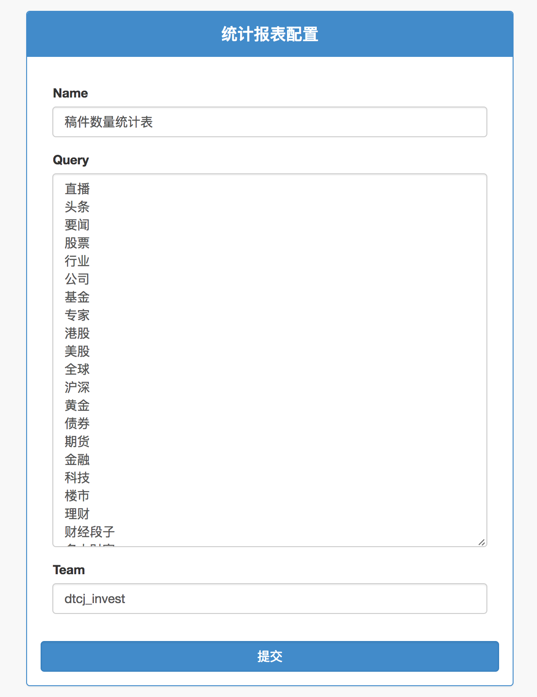

[返回文档目录](../)

## 目前Invest新增栏目流程

### 1.在admin后台 **输出栏目** 页面添加一个栏目

  
  

输入内容说明：

| 字段名 | 说明 | 是否必填 | 注意 |
|:---:| :-----------: | :----------- |
| Name | 栏目名称 | 是 | 不可重复，不可与专题名称重复，会影响到统计 |
| Code | 栏目编号 | 是 | 不可与其他栏目编号重复 |
| Target | 栏目输出目标 | 是？ | 若设置为internal，则此栏目下的资讯可以输出，但输出时不会带上此栏目标签 |
| Sort | 栏目排序 | 是 | 最后一位代表在一行内的顺序，前几位代表行顺序 |
| Description | 栏目说明 | 否 | 前端鼠标悬浮在栏目上时，会有气泡说明 |
| Old Version | 旧版栏目 | 否 | 前端会在栏目按钮中以（XX）跟在栏目名称后面 |
| Active | 是否启用 | 是 | 不要删除栏目，尽量用设为false的方式 |
| Team | 使用团队 | 是 | 使用此栏目的团队，目前有dtcj_invest和dtcj_uc |

@李丰 疑问：
* 填Code有什么用处？
* Target是否需要，因为针对每个客户都会配置输出哪些栏目？是不是只要能设置是不是internal就可以
* Sort控制换行的逻辑是按10换行是吧？
* 直接删除一个栏目会有哪些影响？

### 2.在客户输出栏目中增加新增的栏目

注意不要删除之前的栏目，新增的栏目加在最后以空格分割即可

@李峰 疑问：
* 删除不需要输出的栏目会有什么影响？

### 3.在统计报表配置中添加新增的栏目

主要是在“稿件数量统计表”中添加。

### 4.在Invest后台账号权限管理页面，为用户添加栏目权限

 
