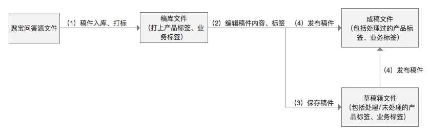
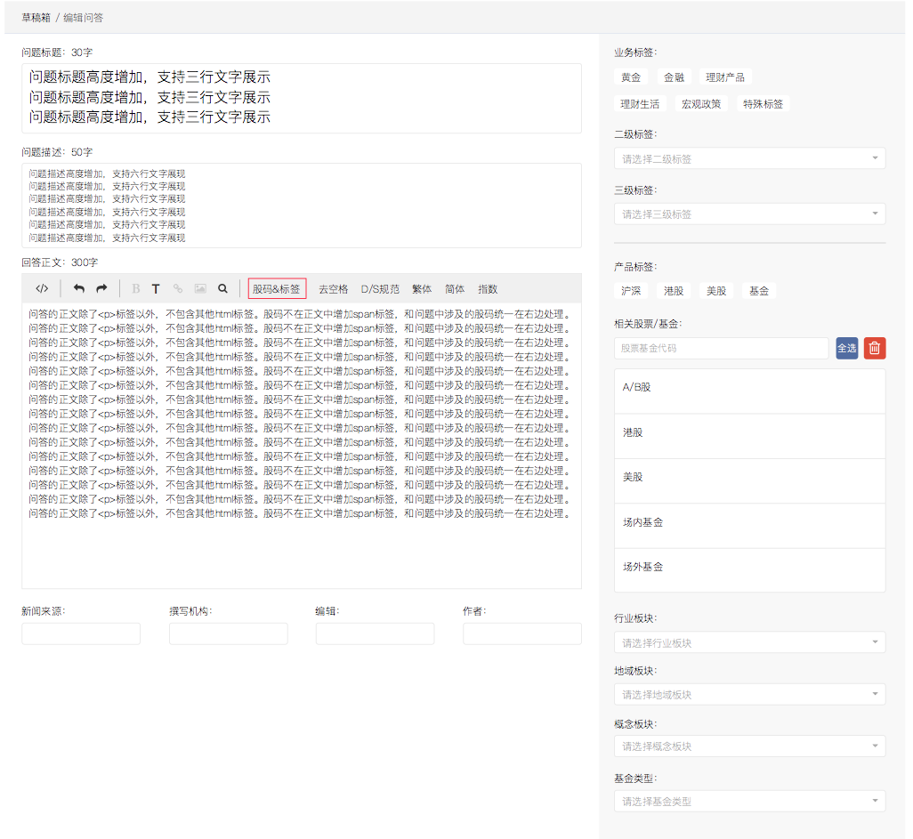
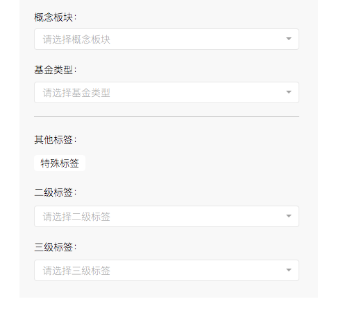
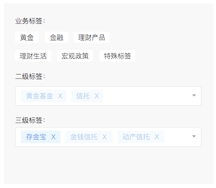
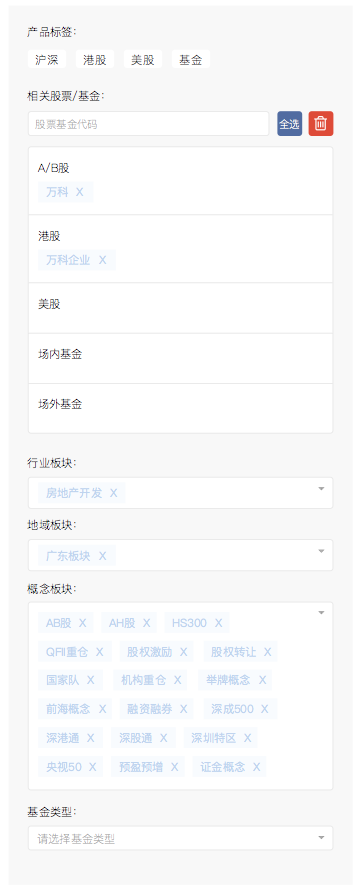
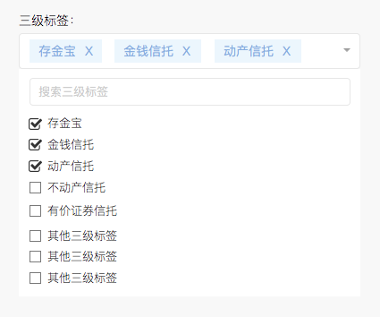
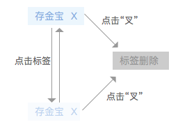
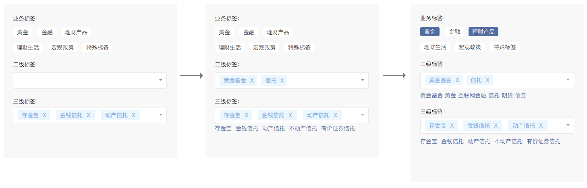
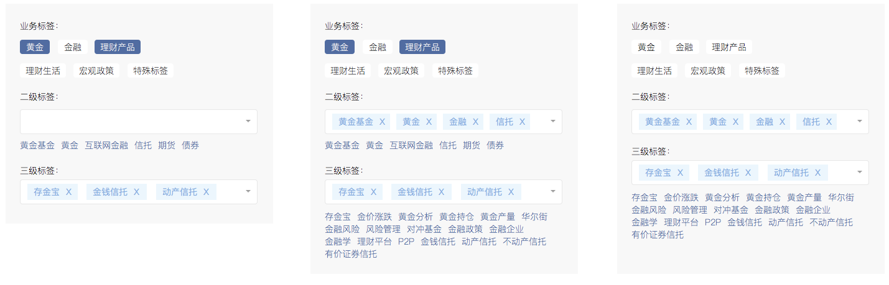
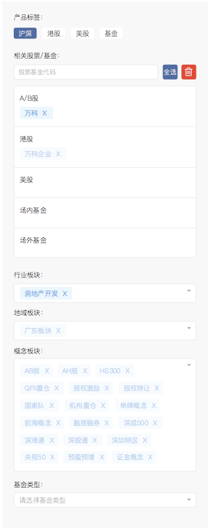

[返回文档目录](../)

# 聚宝问答模块后台

| 日期 | 修订人 | 修订内容 |
|:---:|  :-----------: | :----------- |
| 20170510 | 朱近凡 | 增加了问答稿件自动回传功能需求 |
| 20170510 | 朱近凡 | 修改了业务三级标签内容 |
| 20170417 | 朱近凡 | 修改了三级标签的匹配规则，按关键词列表匹配（注意之前有一个金融III按金融匹配，修改后没有了） |
| 20170417 | 朱近凡 | 增加了其他标签的编辑原型，见2.3 问答编辑页面 |
| 20170412 | 朱近凡 | 补充了宏观政策-热点事件下的金融三级标签，输出为“金融III”的规则 |
| 20170411 | 朱近凡 | 补充了聚宝问答文件入库时所带产品及业务标签情况的处理逻辑；注明了第一版入库时后端不针对业务标签打标，由前端打标。 见2.2 入库打标规则 |
| 20170410 | 朱近凡 | 补充了稿件储存部分的字段说明及注意事项，同时增加了基金类型的储存字段fund_types。见2.7 稿件文件储存。 |
| 20170410 | 朱近凡 | 补充了黄金和金融一二级标签输出时的规范；修改了2.6传输字段说明，板块和基金类型标签按名称放入keywords中。见2.6 稿件文件推送。|  
| 20170410 | 朱近凡 | 补充了稿件操作部分，包括发布、修改、伪下线、重发、取消编辑。见2.5 稿件操作。 |

## 目录
* [1. 功能流程及概览](#1-功能流程及概览)  
* [2. 功能详情](#2-功能详情)  
  * [2.1 问答稿件入库](#21-问答稿件入库)  
    * [数据字典](#数据字典)
    * [传输字段修改说明](#传输字段修改说明)
  * [2.2 入库打标规则](#22-入库打标规则)
  * [2.3 问答编辑页面](#23-问答编辑页面)
  * [2.4 标签编辑](#24-标签编辑)
    * [自动标签匹配](#自动标签匹配)
    * [手动筛选并选中标签](#手动筛选并选中标签)
  * [2.5 稿件操作](#25-稿件操作)
  * [2.6 稿件文件推送](#26-稿件文件推送)
  * [2.7 稿件文件储存](#27-稿件文件储存)
* [附录1：业务标签列表](#附录1业务标签列表)
* [附录2：产品标签列表](#附录2产品标签列表)
* [附录3：其他标签列表](#附录3其他标签列表)
* [附录4：聚宝合作流程及注意事项](#附录4聚宝合作流程及注意事项)
  * [技术流程](#技术流程)
  * [问答处理流程](#问答处理流程)
  * [运营抽检和复核机制](#运营抽检和复核机制)

## 1. 功能流程及概览

&emsp;&emsp;（1）稿件入库、打标：聚宝传入文件数据字典见[功能详情-问答稿件入库](#21-问答稿件入库)，入库打标规则见[功能详情-入库打标规则](#22-入库打标规则)；入库的问答稿件可在栏目稿库中筛选查看，并进入编辑页面。  

&emsp;&emsp;（2）编辑稿件内容、标签：可编辑问题标题、问题描述、回答正文，见[功能详情-问答编辑页面](#23-问答编辑页面)；稿件标签可编辑产品标签、业务标签、其他标签，见[功能详情-标签编辑](#24-标签编辑)。   

&emsp;&emsp;（3）保存稿件：可将未处理完的问答文件保存至草稿箱，见[功能详情-稿件操作](#25-稿件操作)。  

&emsp;&emsp;（4）发布稿件：稿件发布后将稿件文件推送给聚宝，见[功能详情-稿件文件推送](#26-稿件文件推送)；同时可在资讯审核-栏目中管理对已发布的问答稿件进行修改和下线，目前暂未联调稿件的更新和下线，待补充。

## 2. 功能详情
### 2.0 问答稿件自动回传
聚宝问答稿件，在 origin_website 为“无需处理”时，自动回传，回传文件中 title、summary、content、tags、stock_codes、keywords 需和传入文件对应字段内容保持相同。
不影响正常生产的前提下，目前后台处理能力可接受的自动回传类型稿件传入塑料，为“”每半小时，发送4分钟，约3000条”。

### 2.1 问答稿件入库
#### 数据字典

| 字段名 | 业务含义 | 一财改造 |
|:---:| :-----------: | :-----------: |
| title | 问题标题，为空时填“待补充” | 最多支持1000字符，可由编辑修改 |
| summary | 问题描述，为空时不填 | 最多支持4000字符，可由编辑修改 |
| content | 回答，为空时填“待补充” | 最多支持10000字符，可由编辑修改 |
| source_id | 问答对的唯一id |  |
| origin_url | 问题的唯一id |  |
| origin_date | 数据清洗或传输给一财的时间，仅填充required字段，不一定作为导入时的发帖时间 |  |
| compose_organization | 标记外部或内部来源，外部爬取标记，如深圳交易所互动易、内部优质观点转问答 |  |
| origin_website | 稿件处理类型：待清洗问答、待补充问题、待回答 |  |
| stock_codes | 对应产品id，如000001.SZ或000001.OF，与资讯相同，类型为array | 可由编辑修改 |
| tags | 业务标，类型为array | 可由编辑修改  |
| keywords | 补充标（算法标，类型为array） | 可由编辑修改 |
| options | map类型的扩展字段 | 需新增该字段 |  
|question_editable|问题是否可修改|若不可编辑则禁用title和summary的编辑|
|answer_editable|回答是否可修改|若不可编辑则禁用content的编辑|

> 备注：问答类型文件在稿库中可通过渠道“聚宝问答”来区分  
> 备注：content中的`\n`会处理成`

`后再传给一财，原社区数据中`{{T_0}}`等占位符会删除；content中除了`
`标签外，不会包含其他html标签。

#### 传输字段修改说明：

1. title对应问题（最多1000个字符）
2. summary对应问题描述（最多4000个字符）
3. content对应回答（最多10000个字符，回答中会统一处理成`

`后再传给一财），标签的3个字段待定，需新增一个map类型的扩展字段（不需要一财修改）

### 2.2 入库打标规则

* 产品标签的打标：  
  * 根据 **问题标题、问题描述、回答正文** 内容与股票、基金名称的匹配情况（完全匹配），为问答稿件增加对应的产品标签，包括股票基金标签，及相关的板块标签；
  * 聚宝传输问答原文件进稿库时，可能会带上一些产品标签，打标时不做删除处理，且为未选中状态；
  * 在匹配时，会考虑到股票名优先级、股票中文名简称、同名股票三个规则。  

* 业务标签的打标（第一版由前端在编辑从稿库进入稿件编辑时打标）：  
  * 三级标签的打标：若 **问题标题、问题描述、回答正文** 内容与[附录1：业务标签列表](#附录1业务标签列表)中 **关键词** 列中某个关键词完全匹配，则标记对应的三级标签。
  * 二级标签的打标：1）对匹配到的三级标签，标记对应的父级二级标签；2）若 **问题标题、问题描述、回答正文** 内容与[附录1：业务标签列表](#附录1业务标签列表)中某 **二级标签** 完全匹配，则标记对应的二级标签；
  * 聚宝传输问答原文件进稿库时，可能会带上一些业务标签，打标时不做删除处理，且为未选中状态。

* 入库时匹配的产品标签和业务标签，在第一次进入稿件编辑页面时，均为 **未选中** 状态。

### 2.3 问答编辑页面  

* 问题标题输入，最多1000字符，对应500中文字，若`question_editable`为`false`，则不可编辑。

* 问题描述输入，最多4000字符，对应2000中文字，若`question_editable`为`false`，则不可编辑。

* 回答正文输入，最多10000字符，对应5000中文字，若`answer_editable`为`false`，则不可编辑。

* 第一期除了`
`标签用于分段以外，问答内容不包含其他html标签，所以原编辑器中的加粗、超链接、插入图片功能可暂时禁用。

* 新闻来源、撰写机构不可编辑。

* 编辑、作者可编辑，不过目前暂时没有太多被编辑的可能。

* 标签在界面上分为业务标签、产品标签、和算法标签。
  * 业务标签：业务标签包括三级，在界面上分别显示为 **业务标签、二级标签、三级标签** ，标签列表及对应关系见[附录1：业务标签列表](#附录1业务标签列表)。业务标签层级间存在勾选和相关推荐的关联关系，具体逻辑见[功能详情-手动筛选并选中标签](#手动筛选并选中标签)。

  * 产品标签：产品标签包括三级。一级在界面上显示为 **产品标签** ，包括沪深、港股、美股、基金四个产品类别；二级在界面上显示为 **行业板块、地域板块、概念板块、基金类型** ，其中板块列表是同步的聚源数据，基金类型目前没有，需增加[附录2：产品标签列表](#附录2产品标签列表)中基金下的二级标签。产品标签层级间的勾选无关联逻辑。

  * 其他标签：算法标签包括三级。目前一个一级标签“特殊标签”，其下只有一个二级标签“内容推荐标签”。“内容推荐标签”下只有一个三级标签“推荐”。“其他标签”的勾选和关联关系同业务标签，但暂不进行自动匹配。其他标签的界面和业务标签相同，放在产品标签下方：

  

### 2.4 标签编辑

进入问答稿件编辑页面后，标签编辑包括两种方式：

#### 自动标签匹配
  &emsp;&emsp;点击 **股票&标签** 按钮，根据 **问题标题、问题描述、回答正文** 内容自动匹配产品及业务标签，规则同 [功能详情-入库打标规则](#)：

  * 三级标签的打标：若 **问题标题、问题描述、回答正文** 内容与[附录1：业务标签列表](#附录1业务标签列表)中 **关键词** 列中某个关键词完全匹配，则标记对应的三级标签。
  * 二级标签的打标：1）对匹配到的三级标签，标记对应的父级二级标签；2）若 **问题标题、问题描述、回答正文** 内容与[附录1：业务标签列表](#附录1业务标签列表)中某 **二级标签** 完全匹配，则标记对应的二级标签；

  &emsp;&emsp;自动匹配而新增的标签均为未选中状态。自动匹配标签对已选中的标签无影响，不会删除或取消选中这些标签。对于未选中的标签，若点击“股码&标签”时匹配不到，则会删除。

  &emsp;&emsp;举例1：若文中包括关键词黄金基金、金钱信托、动产信托，且在点击 **股票&标签** 按钮之前已经选中了存金宝标签。则不会改版存金宝的选中状态，同时增加未选中状态的标签黄金基金（二级）、金钱信托（三级）、动产信托（三级），以及金钱信托、动产信托对应的二级标签信托。

  

  &emsp;&emsp;举例2：若文章包括股票名称万科，则匹配万科对应的股码及涉及的板块，且为未选中状态。

  

#### 手动筛选并选中标签
* 标签的添加：对于二三级标签，可点击输入框从下拉菜单中搜索并添加标签，被添加的标签为选中状态。  

  

* 标签的选中/取消选中：可通过点击标签本身对标签进行选中/取消选中，只有选中的标签才会保存并传输给聚宝。

* 标签的删除：可点击“X”来删除标签，股票基金标签删除后同时会删除文中的股码，在问答界面暂时无实际用途。

  

* 业务标签勾选逻辑  
  * **添加/选中** 一个三级业务标签 自动 **添加/选中** 对应的二级业务标签
  * **添加/选中** 一个二级业务标签 自动 **选中** 对应的一级业务标签
  * 举例，若如下图添加了三个三级标签，则会自动添加/选中对应的二级和一级标签。下图为动作拆解，实际上两步是自动完成的。

  

* 相关业务标签推荐逻辑
  * 相关业务标签推荐，指的是标签输入框下方蓝色字的标签提示，点击标签可在输入框中添加对应标签
  * 一级标签未选中时，二级无相关标签；选中一级时，二级相关标签为一级标签对应的所有二级标签。
  * 二级标签未选中时，三级无相关标签；选中二级标签时，三级相关标签为二级标签对应的所有三级标签。

  

* 产品标签勾选
  * 产品标签的勾选不存在关联逻辑
  * 基金类型选择框的下拉菜单中，包含以下选项：LOF、ETF、保本基金、分级基金、QDII、指数基金、货币基金、债券基金、混合基金、债券基金。

  

### 2.5 稿件操作
针对稿件的操作包括：发布、修改（更新）、取消编辑、下线（伪下线）、重发。

* 发布：在编辑页面点击发布按钮，则按[2.6 稿件文件推送](#26-稿件文件推送)的字段规定推送给聚宝。Invest后台中，已发布的问答稿件进入资讯审核-栏目列表中，可用过文章类别进行筛选。在列表中可对稿件进行修改（更新）。

* 修改（更新）：在资讯审核列表中，点击管理-修改，或在稿件预览页面点击修改。则进入稿件编辑页面。可修改后发布更新稿件。

* 取消编辑：在稿库中进入编辑页面，点击取消，则删除草稿并退出编辑；在审核列表中进入编辑页面，点击取消，则直接退出编辑。

* 下线（伪下线）：在资讯审核列表中，点击管理-下线，或在稿件预览页面点击下线。则后台将稿件置为下线状态，但不向聚宝发送下线消息。

* 重发：已下线的问答稿件，点击重发按钮，则和修改（更新）相同，重新发布稿件。同时稿件置为已发布状态。

### 2.6 稿件文件推送

> 注：黄金和金融标签，在输出时，按照一级和二级，分别输出为“黄金I”、“黄金II”、“金融I”、“金融II”。宏观政策-热点事件下的金融三级标签，输出为“金融III”。

| 对应聚宝字段 | Invest输入项 | 输入项内容范围 |
|:---:| :-----------: | :----------- |
|title|问题标题|问题标题内容，最多支持1000字符|
|summary|问题描述|问题描述内容，最多支持4000字符|
|content|回答正文|回答正文内容，最多支持10000字符|
|tags|一级业务标签|黄金I、金融I、理财产品、理财生活、宏观政策|
|tags|二级业务标签|黄金II、金融II、互联网金融、信托、期货、债券、置业指南、公积金、职场、股市操作指南、投资参考、玩转保险、信用生活、定期理财、古董收藏、家庭理财、个人理财、理财杂谈、热点政策、热点事件|
|tags|三级业务标签|见附录1：业务标签列表，不包括特殊标签下的所有三级业务标签。注意宏观政策-热点事件下有一个金融三级标签，输入输出时按金融III|
|tags|一级产品标签|沪深、港股、美股、基金|
|keywords|行业板块|所有行业板块中文名称，不是板块id|
|keywords|地域板块|所有地域板块中文名称，不是板块id|
|keywords|概念板块|所有概念板块中文名称，不是板块id|
|keywords|基金类型|LOF、ETF、保本基金、分级基金、QDII、指数基金、货币基金、债券基金、混合基金、债券基金|
|keywords|一级其他标签|特殊标签|
|keywords|二级其他标签|内容推荐标签|
|keywords|三级其他标签|推荐|
|stock_codes|股票基金代码|所有股票、基金代码|
|updated_at|更新时间|Ex:2017-04-10T16:25:12.824+08:00|

### 2.7 稿件文件储存

> 注：一二三级业务标签及一级产品标签，均存在tags字段中，需要前端自行匹配。  
> 注：黄金和金融标签，在存储时，按照一级和二级，分别储存为“黄金I”、“黄金II”、“金融I”、“金融II”。宏观政策-热点事件下的金融三级标签，储存为“金融III”。前端显示和检测时，还是按照“黄金”、“金融”来显示和检测。

| 储存字段 | Invest输入项 | 输入项内容范围 |
|:---:| :-----------: | :----------- |
|title|问题标题|问题标题内容，最多支持1000字符|
|summary|问题描述|问题描述内容，最多支持4000字符|
|content|回答正文|回答正文内容，最多支持10000字符|
|tags|一级业务标签|黄金I、金融I、理财产品、理财生活、宏观政策|
|tags|二级业务标签|黄金II、金融II、互联网金融、信托、期货、债券、置业指南、公积金、职场、股市操作指南、投资参考、玩转保险、信用生活、定期理财、古董收藏、家庭理财、个人理财、理财杂谈、热点政策、热点事件|
|tags|三级业务标签|见附录1：业务标签列表，不包括特殊标签下的所有三级业务标签|
|tags|一级产品标签|沪深、港股、美股、基金|
|industries|行业板块|所有行业板块id|
|regions|地域板块|所有的地域板块id|
|concepts|概念板块|所有概念板块id|
|fund_types|基金类型|LOF、ETF、保本基金、分级基金、QDII、指数基金、货币基金、债券基金、混合基金、债券基金|
|keywords|行业板块；地域板块；概念板块；基金类型；一二三级其他标签|所有行业板块中文名称；所有地域板块中文名称；所有概念板块中文名称；LOF、ETF、保本基金、分级基金、QDII、指数基金、货币基金、债券基金、混合基金、债券基金；特殊标签、内容推荐标签、推荐|
|stock_codes|股票基金代码|所有股票、基金代码|
|updated_at|更新时间|Ex:2017-04-10T16:25:12.824+08:00|

## 附录1：业务标签列表

|一级业务标签|二级业务标签|三级业务标签|关键词|
|:---:| :-----------: | :-----------: | :----------- |
|黄金I|黄金基金|存金宝|存金宝、博时黄金|
|黄金I|黄金II|金价涨跌|金价涨跌、黄金走势|
|金融I|金融II|||
|理财产品|互联网金融|余额宝问答专区|余额宝、天弘货币、宝宝类产品|
|理财产品|信托|||
|理财产品|期货|||
|理财产品|短期理财|||
|理财产品|债券|||
|理财生活|置业指南|||
|理财生活|公积金|||
|理财生活|职场|||
|理财生活|股市操作指南|||
|理财生活|投资参考|||
|理财生活|玩转保险|||
|理财生活|信用生活|||
|理财生活|定期理财|||
|理财生活|古董收藏|||
|理财生活|家庭理财|||
|理财生活|个人理财|大学生理财|大学生理财、大学生兼职|
|理财生活|个人理财|白领理财|白领理财、上班族、年收入|
|理财生活|理财杂谈|||
|宏观政策|热点政策|||
|宏观政策|热点事件|人民币汇率|人民币汇率|
|宏观政策|热点事件|美联储加息|美联储加息、美联储、耶伦|
|宏观政策|热点事件|两会|两会、全国人民代表大会、全国人民政治协商会议|
|宏观政策|热点事件|大小非农|大小非农、美国就业人数|
|宏观政策|热点事件|大选|大选、选举民调|
|宏观政策|热点事件|一带一路|一带一路、丝绸之路经济带、21世纪海上丝绸之路|
|宏观政策|热点事件|证监会发布|证监会发布、资本市场监管、张晓军、邓舸|

## 附录2：产品标签列表

|一级产品标签|二级产品标签|三级产品标签|
|:---:| :-----------: | :-----------: |
|沪深|行业板块|类别下全部个股|
|沪深|概念板块|类别下全部个股|
|沪深|地域板块|类别下全部个股|
|港股|/|全部港股|
|美股|/|全部美股|
|基金|股票基金|类别下全部基金|
|基金|混合基金|类别下全部基金|
|基金|债券基金|类别下全部基金|
|基金|货币基金|类别下全部基金|
|基金|指数基金|类别下全部基金|
|基金|QDII|类别下全部基金|
|基金|分级基金|类别下全部基金|
|基金|保本基金|类别下全部基金|
|基金|ETF|类别下全部基金|
|基金|LOF|类别下全部基金|
|/|/|全部黄金基金|

## 附录3：其他标签列表

|一级其他标签|二级其他标签|三级其他标签|
|:---:| :-----------: | :-----------: |
|特殊标签|内容推荐标签|推荐|

## 附录4：聚宝合作流程及注意事项

### 技术流程：

1. 数据同学负责汇总所有来源数据（爬取、内部整理），清洗后，写入mysql表中
2. 聚宝服务端读取mysql表将数据post 一财的http接口
3. 一财打标完成后将数据post 聚宝服务端提供的http接口
4. 聚宝服务端导入问答库

> 注：导入数据包括以下4部分：
> 1. 爬虫内容
> 2. 基金公司内容------大概会涉及1500只基金，对应35家基金公司
> 3. 结构化内容处理-----覆盖长尾基金和股票
> 4. 历史内容转问答----按问题+commetid格式，部分内容已完成问题编写，部分内容需一财同学协助处理
> 5. 第2、3、4部分数据由聚宝运营同学离线提供，由聚宝数据同学统一处理成约定格式，写入流程1中的mysql/hbase表中

### 问答处理流程

1. `一问一答`作为一条数据传输，如果原始问答中一条问题有多个回答，则拆成一问一答多条数据传输。
2. `一问一答`作为一个整体打标，打标要综合考虑问和答的内容。
3. 一条数据中可能缺失问或者答，当缺失时，在稿件来源字段中标记，需要一财同学根据未缺失部分补充缺失的问或者答。
4. 一财同学需要做的事情：补充缺失的问或答、对问答文字修改美化、对问答综合打标。

> 注：打标内容包括
> 1. 股码
> 2. 业务标：规划有圆桌对应的标签（如事件标、行业标、一级大类标签）
> 3. 补充标（算法标）：除业务标外其他标签，如二级、三级细化标签。

### 运营抽检和复核机制

一财回传数据入库后，由数据同学定时分发抽检数据，交由运营评估。发现错误的告知一财修改，并再次回传更新数据；发现大量错误时由运营发起应急机制，可采取`暂停打标`、`重新沟通`等措施。

> 注：`业务标`和`补充标`由运营同学指定。 三部分标签按三个字段回传给聚宝服务端，聚宝服务端对于`补充标`标签单独存储。
