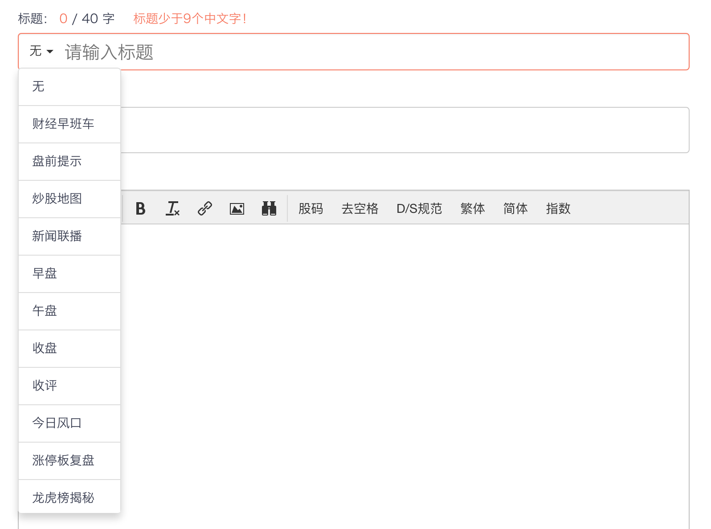
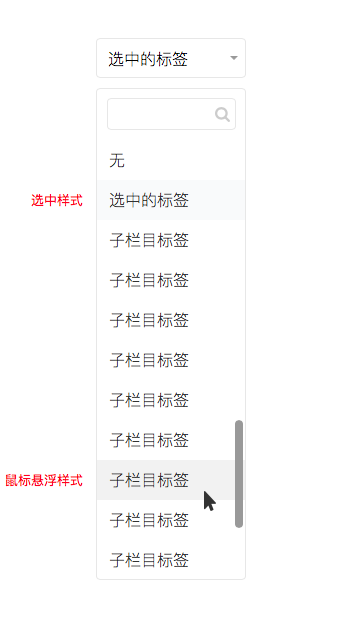
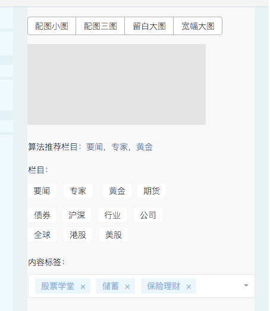
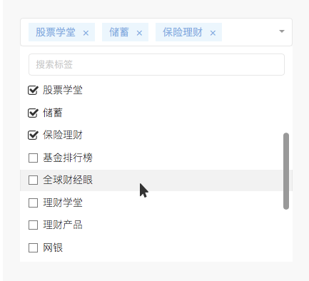

[返回文档目录](../)

### 子栏目标签

子栏目标签为单选框，位置在标题栏，见下方截图：

单选控件包括：输入框、下拉列表、搜索框。
* 输入框内容默认为“无”；
* 下拉列表内容目前在admin后台“子栏目”页面配置；每格子背景为白色，包括选中样式和鼠标浮层样式；
* 搜索框支持中文及拼音搜索；

原型：

### 内容标签

内容标签为复选框，样式与地域板块相同。未来会扩充为三级内容标签体系，目前的内容标签即为未来的三级内容标签。一级二级标签与三级强相关，主要用于输出和查询的筛选。

内容标签，位置在栏目选择下方：

复选控件包括：输入框、下拉列表、搜索框
* 输入框内容默认为空，文案为“请选择标签”；
* 下拉列表内容目前在admin后台“内容标签”页面配置；每格子背景为白色，包括鼠标浮层样式；
* 搜索框支持中文及拼音搜索；

原型：

### 附录：唯品会内容标签列表及输出对应

| 内容标签 | 输出标签 |
|:---:| :-----------: |
|股票学堂|理财学堂|
|基金学堂|理财学堂|
|基金排行榜|基金排行榜|
|全球财经眼|全球财经眼|
|美股学堂|理财学堂|
|储蓄|储蓄|
|理财产品|理财产品|
|网银|网银|
|银行卡|银行卡|
|保险理财|保险理财|
|信用卡|信用卡|
|征信|征信|
|信用生活|信用生活|
|理财案例|理财案例|
|理财技巧|理财技巧|
|另类投资|另类投资|
|名人财富|名人财富|
|财经段子|财经段子|
|汽车|汽车|
|消费升级|消费升级|
|时尚生活|时尚生活|
|休闲娱乐|休闲娱乐|
|旅游出行|旅游出行|
|互联网金融|互联网金融|
|支付安全|支付安全|
|3C产品|3C产品|
|生活小窍门|生活小窍门|
|医疗健康|医疗健康|
|房价|楼市投资|
|房租|楼市投资|
|楼市供需|楼市投资|
|房贷|楼市投资|
|公积金|楼市投资|
|买房指南|楼市投资|
|装修|楼市投资|
