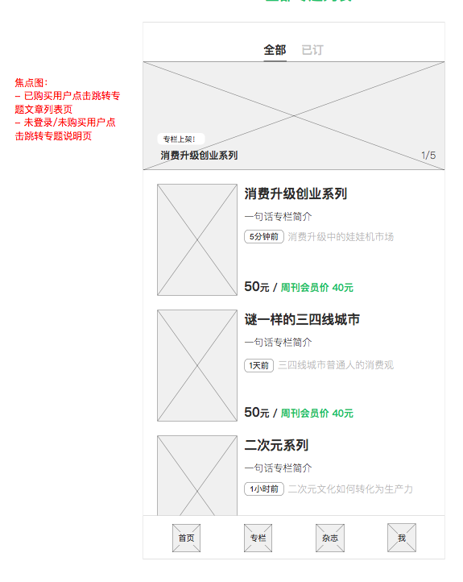
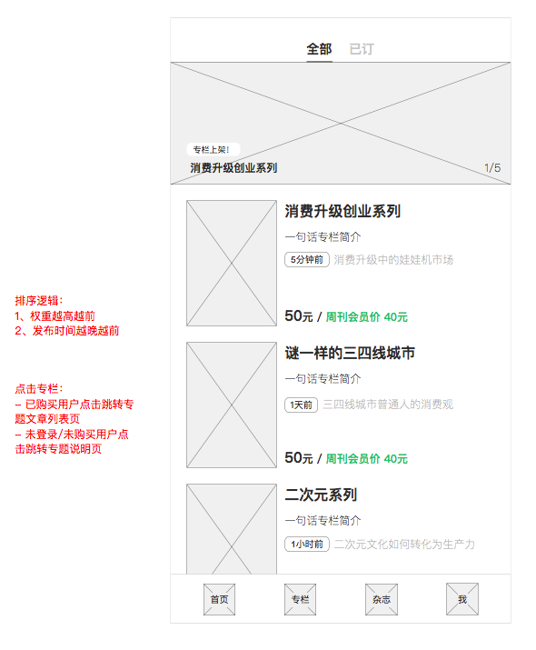

[返回文档目录](../)

## 20170612周刊APP迭代需求文档（ios3.0.9/android3.0.5）

### 1. 首页焦点图

|推荐类型|跳转页面|
|:---:| :----------- |
|普通文章|文章详情页|
|杂志|杂志目录页|
|专题|专题详情页|
|专栏|已购买用户-专栏详情页；未登录、未购买用户-专栏说明页|

&emsp;&emsp;  

|焦点图元素|类型|可以为空|
|:---:| :-----------: | :-----------: |
|主标题|文本|是|
|副标题|文本|是|
|焦点图封面|图片|否|

&emsp;&emsp;  

原型：

### 2. 专栏模块
2.1-2.7节主要介绍各个界面情况。

此次专栏模块更新涉及到之前页面的专栏文章露出，专栏详情页、专栏说明页进入的逻辑，以及专栏文章页进入逻辑，见以下几节介绍：
* [2.8 专栏文章出现的页面](#)
* [2.9 专栏文章的不同状态](#)
* [2.10 专栏说明页、专栏详情页进入逻辑](#)

#### 2.1 专栏列表-焦点图

|推荐类型|跳转页面|
|:---:| :----------- |
|专栏|已购买用户-专栏详情页；未登录、未购买用户-专栏说明页|

&emsp;&emsp;  

|焦点图元素|类型|可以为空|
|:---:| :-----------: | :-----------: |
|主标题|文本|是|
|副标题|文本|是|
|焦点图封面|图片|否|

&emsp;&emsp;  

原型：

#### 2.2 专栏列表-全部专栏

|元素类型|说明|
|:---:| :----------- |
|专栏封面|封面图片|
|专栏标题||
|一句话简介||
|最新文章|标签：最新文章发布相对时间；最新文章标题，不可点击|
|价格|见价格显示逻辑|

&emsp;&emsp;  

相对时间显示逻辑：
* 1分钟内：显示“1分钟前”
* 1小时内：显示“X分钟前”
* 晚于当天0点：显示"X小时前"
* 早于当天0点：显示“X天前”
* 早于10天前：显示月份日期“XX-XX”，如“06-12”
* 早于10天前且为去年：显示年份月份“XXXX-XX”，如“2016-12”

专栏列表排序按以下两个规则先后排序：
* 权重越高越前
* 相同权重时，发布时间越晚越前

专栏价格显示逻辑：
* 未购买，且用户未登录/为非周刊会员：普通价格为绿色
* 未购买，且用户为周刊会员：会员价格为绿色
* 已购买：显示“已购买”

原型：

#### 2.3 已定列表

#### 2.4 专栏说明页

#### 2.5 试读列表

#### 2.6 专栏购买

#### 2.7 专栏详情页

#### 2.8 专栏文章会出现的页面

#### 2.9 专栏文章的不同状态

#### 2.10 专栏说明页、专栏详情页进入逻辑

### 3. 首页-继续阅读按钮

### 4. 会员有效期

### 5. 购买记录

### 6. 文章版权说明

### 7. 杂志模块-离线杂志入口

### 8. 文章中可插入视频

### 9. 阅读市场文案调整

### 10. 之前页面的文案调整
