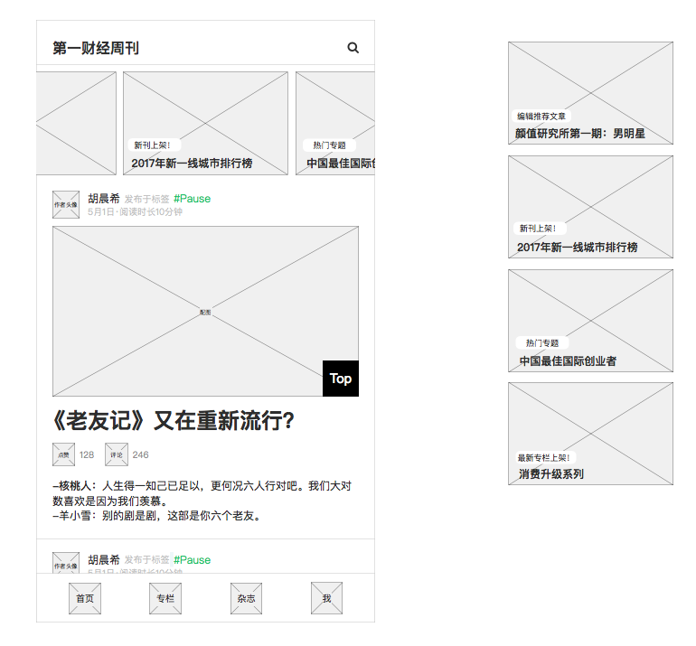
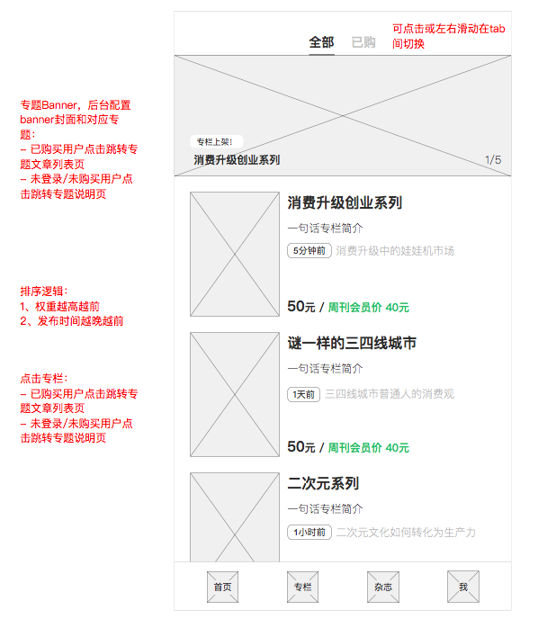
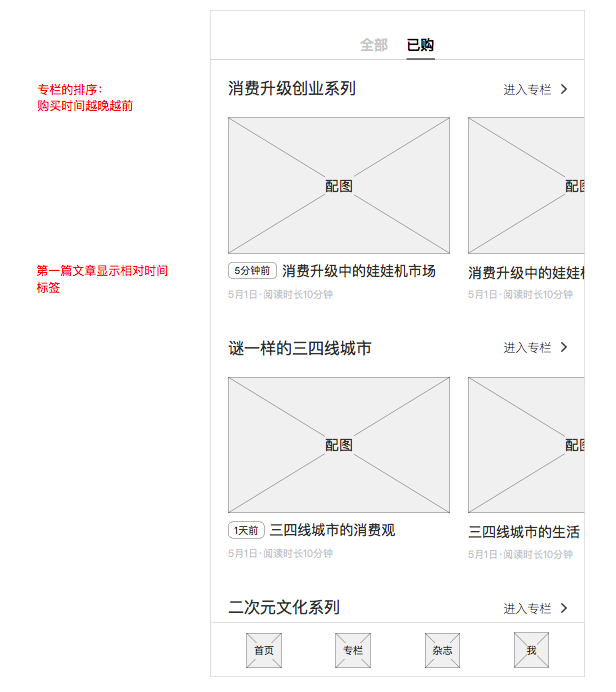
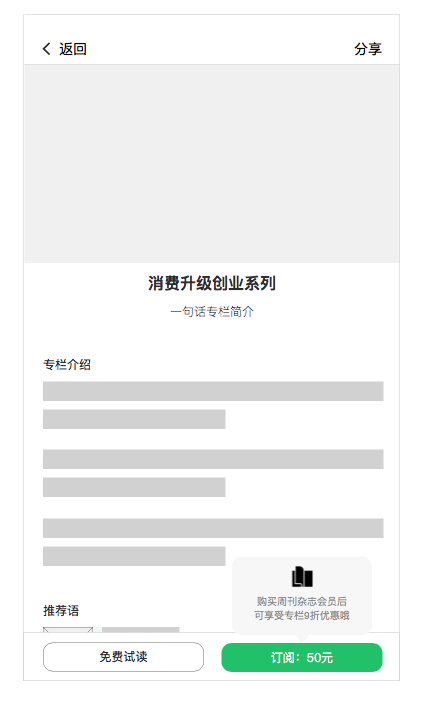
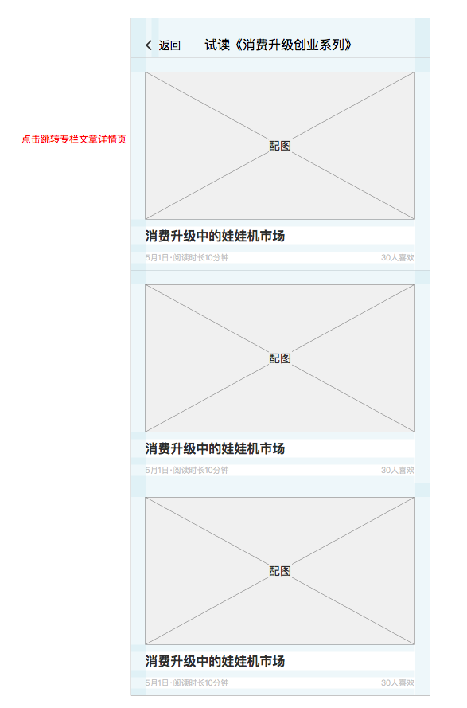
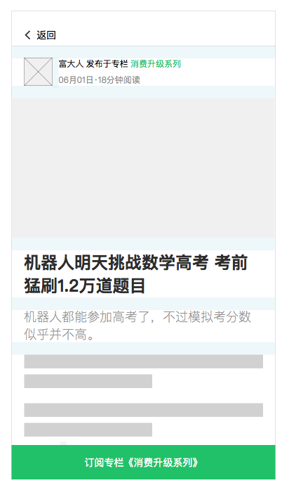
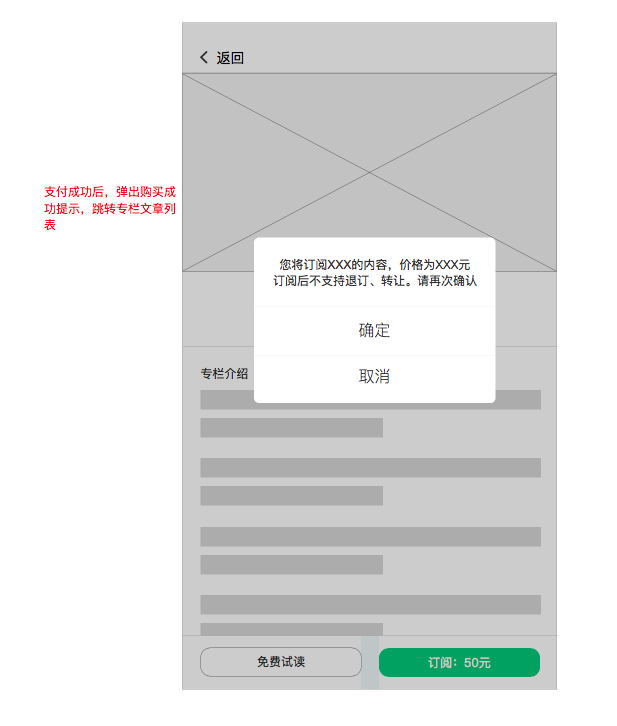

[返回文档目录](../)

## 20170612周刊APP迭代需求文档（ios3.0.9/android3.0.5）

### 目录

* [1. 首页焦点图](#1-首页焦点图)
* [2. 专栏模块](#2-专栏模块)
  * [2.1 专栏列表-焦点图](#21-专栏列表-焦点图)
  * [2.2 专栏列表-全部专栏](#22-专栏列表-全部专栏)
  * [2.3 已购买列表](#23-已购买列表)
  * [2.4 专栏说明页](#24-专栏说明页)
  * [2.5 试读](#25-试读)
    * [2.5.1 试读列表](#251-试读列表)
      * [2.5.2 试读文章](#252-试读文章)
    * [2.6 专栏购买](#26-专栏购买)
    * [2.7 专栏详情页](#27-专栏详情页)
    * [2.8 专栏文章会出现的页面](#28-专栏文章会出现的页面)
    * [2.9 专栏文章的不同状态](#29-专栏文章的不同状态)
    * [2.10 专栏说明页、专栏详情页进入逻辑](#210-专栏说明页专栏详情页进入逻辑)
      * [2.10.1 未登录用户](#2101-未登录用户)
        * [2.10.2 登录未购买用户](#2102-登录未购买用户)
        * [2.10.3 登录已购买用户](#2103-登录已购买用户)
* [3. 首页-继续阅读按钮](#3-首页-继续阅读按钮)
* [4. 会员有效期](#4-会员有效期)
* [5. 购买记录](#5-购买记录)
* [6. 文章版权说明](#6-文章版权说明)
* [7. 杂志模块-离线杂志入口](#7-杂志模块-离线杂志入口)
* [8. 文章中可插入视频](#8-文章中可插入视频)
* [9. 阅读市场文案调整](#9-阅读市场文案调整)
* [10. 之前页面的文案调整](#10-之前页面的文案调整)

### 1. 首页焦点图

首页焦点图轮播逻辑：

* 自动滚动：每5秒向下一张滚动
* 自动滚动：最后一张焦点图的下一张，为第一张焦点图，循环滚动
* 若用户手动滚动，则自动滚动暂停10秒

首页焦点图元素：

|焦点图元素|类型|可以为空|说明|
|:---:| :-----------: | :-----------: | :-----------: |
|主标题|文本|是||
|副标题|文本|是||
|焦点图封面|图片|否||
|点击跳转|对象|否|具体跳转情况见下|

&emsp;&emsp;  

焦点图不同荐类型跳转页面：

|推荐类型|跳转页面|
|:---:| :----------- |
|普通文章|文章详情页|
|杂志|杂志目录页|
|专题|专题详情页|
|专栏|已购买用户-专栏详情页；未登录、未购买用户-专栏说明页|

&emsp;&emsp;  

原型：

### 2. 专栏模块
2.1-2.7节主要介绍各个界面情况。

此次专栏模块更新涉及到之前页面的专栏文章露出，专栏详情页、专栏说明页进入的逻辑，以及专栏文章页进入逻辑，见以下几节介绍：

* [2.8 专栏文章出现的页面](#)
* [2.9 专栏文章的不同状态](#)
* [2.10 专栏说明页、专栏详情页进入逻辑及流程举例](#)

注意：专栏文章的分享页需要有专栏的引导

#### 2.1 专栏列表-焦点图

专栏焦点图轮播逻辑：

* 自动滚动：每5秒向下一张滚动
* 自动滚动：最后一张焦点图的下一张，为第一张焦点图，循环滚动
* 若用户手动滚动，则自动滚动暂停10秒

专栏焦点图元素：

|焦点图元素|类型|可以为空|说明|
|:---:| :-----------: | :-----------: | :----------- |
|主标题|文本|是||
|副标题|文本|是||
|焦点图封面|图片|否||
|页面位置标记|文本|-|当前第几张/焦点图总数|
|点击跳转|对象|否|已购买用户-专栏详情页；未登录、未购买用户-专栏说明页|

&emsp;&emsp;  

原型：

#### 2.2 专栏列表-全部专栏

专栏列表排序按以下两个规则先后排序：

* 权重越高越前
* 相同权重时，发布时间越晚越前

专栏元素说明：

|元素类型|说明|
|:---:| :----------- |
|专栏封面|封面图片|
|专栏标题||
|一句话简介||
|最新文章|标签：最新文章发布相对时间；最新文章标题，不可点击|
|价格|见价格显示逻辑|
|点击跳转页面|已购买用户-专栏详情页；未登录、未购买用户-专栏说明页|

&emsp;&emsp;  

相对时间标签显示逻辑：

|时间范围|显示方式|
|:---:| :----------- |
|1分钟内|显示“1分钟前”|
|1小时内|显示“X分钟前”|
|晚于当天0点|显示"X小时前"|
|早于当天0点|显示“X天前”|

&emsp;&emsp;  

专栏价格显示逻辑：

|用户类型|是否购买|显示逻辑|
|:---:| :-----------: | :----------- |
|未登录|-|普通价格绿色高亮|
|非周刊会员|已购买|显示“已购买”|
|非周刊会员|未购买|普通价格绿色高亮|
|周刊会员|已购买|显示“已购买”|
|周刊会员|未购买|高亮“周刊会员价XX元”|

原型：

#### 2.3 已购买列表

未登录及未购买任何专栏的用户，显示默认页。

专栏列表排序按以下规则排序：

* 购买时间越晚越前

专栏元素：

|元素类型|说明|
|:---:| :----------- |
|专栏标题||
|专栏详情入口|点击进入专栏详情页|
|专栏文章|横向滑动，排序按发布时间倒序，最多5篇，点击文章进入文章详情页|
|横向滑动查看更多|专栏文章超过5篇时，向左滑动松手后，进入专栏详情页|

&emsp;&emsp;  

文章元素：

|元素类型|说明|
|:---:| :----------- |
|配图||
|标题||
|相对时间标签|只在最新一篇显示，逻辑如下|
|发布时间|具体日期|
|阅读时长||
|点击跳转|点击跳转专栏文章详情|

&emsp;&emsp;  

相对时间标签显示逻辑：

|时间范围|显示方式|
|:---:| :----------- |
|1分钟内|显示“1分钟前”|
|1小时内|显示“X分钟前”|
|晚于当天0点|显示"X小时前"|
|早于当天0点|显示“X天前”|

&emsp;&emsp;  

原型：

#### 2.4 专栏说明页

说明页元素：

|元素类型|说明|
|:---:| :----------- |
|专栏封面||
|专栏背景||
|专栏分享||
|专栏标题||
|专栏一句话简介||
|专案介绍||
|推荐语||
|作者介绍|头像、姓名、身份、作者介绍均来自作者配置，点击进入作者详情页|
|关键词|不可点击|
|订阅须知||
|最新文章|最新四篇文章标题及摘要，若无文章则不显示此块|
|试读按钮|对已购买用户不显示；点击进入试读列表|
|订阅按钮|对已购买用户不显示；价格根据是否会员决定|
|周刊会员优惠气泡|对已购买用户不显示；点击弹出杂志会员订阅弹窗，显示逻辑见下|

&emsp;&emsp;  

周刊会员优惠气泡显示逻辑：
* 只在第一次进入任一专栏说明页时显示
* 点击页面空白区域会消失，滑动页面、点击可点区域均不会消失
* 消失后下次不会再出现

注意：
试读、订阅、优惠气泡，对于已购买本专栏的用户，不显示

原型：

#### 2.5 试读

##### 2.5.1 试读列表

注意：试读列表没有点赞和回复按钮

元素包括：

|元素类型|说明|
|:---:| :----------- |
|文章配图||
|文章标题||
|文章发布时间||
|文章阅读时长||
|喜欢人数||
|点击跳转|跳转试读文章详情页|

&emsp;&emsp;  

原型：

##### 2.5.2 试读文章

注意：试读文章底部用订阅挡住，右上角可分享  

元素包括：

|元素类型|说明|
|:---:| :----------- |
|作者、专栏||
|发布时间、阅读时长||
|文章配图||
|文章标题||
|文章正文||
|喜欢人数||
|分享|分享试读页，可考虑先不做|
|订阅按钮|点击弹出购买弹窗|

&emsp;&emsp;  

#### 2.6 专栏购买

用户在专栏说明页，点击订阅按钮，弹出确认弹窗。
用户确认并支付后，跳转专栏详情页

原型：

#### 2.7 专栏详情页

元素包括：

|元素类型|说明|
|:---:| :----------- |
|专栏名称||
|一句话简介||
|已更新文章数||
|文章配图||
|最新文章相对时间|只有最新文章显示|
|文章标题||
|发布时间||
|阅读时长||
|喜欢人数||
|分享||
|专栏说明页入口|注意已购买专栏的用户进入专栏说明页，不会有底部的试读和订阅按钮|

#### 2.8 专栏文章会出现的页面

专栏详情页、专栏说明页、专栏试读页、专栏已购买页面之前已说过，不再赘述。

涉及到的老页面包括，这些页面需要增加“专栏文章”以及“试读”的标识，为用户提供页面预期：

* 文章搜索结果
* 作者详情页
* 相关文章推荐
* 喜欢的文章

#### 2.9 专栏文章的不同状态

可能进入专栏文章的情况

|页面|说明|
|:---:| :----------- |
|专栏详情页|用户必有专栏权限，进入后为完整的文章详情页|
|专栏已购买页面|用户必有专栏权限，进入后为完整的文章详情页|
|试读列表|用户必无专栏权限，进入后为文章详情页，底部有专栏的引导|
|文章搜索页|已购买专栏用户-完整文章详情页；未登录/未购买用户&非试读文章-无文章正文，底部专栏引导；未登录/未购买用户&试读文章-有文章正文，底部专栏引导|
|作者详情页|同上|
|相关文章推荐|同上|
|喜欢的文章|用户必有文章权限，进入后为完整文章详情页|

#### 2.10 专栏说明页、专栏详情页进入逻辑

已下均为案例：

##### 2.10.1 未登录用户

1）用户点击首页焦点图、专栏模块焦点图、全部专栏 -> 进入专栏说明页 -> 点击试读 -> 进入试读列表 -> 查看文章 -> 点击底部专栏订阅引导 -> 跳转登录页 ->

登录后若未购买：弹出购买框 -> 购买后跳转专栏详情页 -> 点击返回，回到全部专栏页

登录后若已购买：跳转专栏详情页 -> 点击返回，回到全部专栏页

2）用户点击首页焦点图、专栏模块焦点图、全部专栏 -> 进入专栏说明页 -> 点击订阅 -> 跳转登录页 ->

登录后若未购买：弹出购买框 -> 购买后跳转专栏详情页 -> 点击返回，回到全部专栏页

登录后若已购买：跳转专栏详情页 -> 点击返回，回到全部专栏页

3）用户点击首页焦点图、专栏模块焦点图、全部专栏 -> 进入专栏说明页 -> 点击会员折扣提示 -> 跳转登录页 ->

登录后若未购买：弹出会员购买框 -> 购买后刷新专栏详情页价格 -> 点击返回，回到全部专栏页

登录后若已购买：跳转专栏详情页 -> 点击返回，回到全部专栏页

4）在作者详情页、搜索结果页、相关文章推荐中点击专栏文章（试读&非试读）-> 点击订阅 -> 跳转登录页 ->

登录后若未购买：弹出购买框 -> 购买后跳转专栏详情页 -> 点击返回，回到全部专栏页

登录后若已购买：跳转专栏详情页 -> 点击返回，回到全部专栏页

##### 2.10.2 登录未购买用户

1）用户点击首页焦点图、专栏模块焦点图、全部专栏 -> 进入专栏说明页 -> 点击试读 -> 进入试读列表 -> 查看文章 -> 点击底部专栏订阅引导 -> 弹出购买框 -> 购买后跳转专栏详情页 -> 点击返回，回到全部专栏页

2）用户点击首页焦点图、专栏模块焦点图、全部专栏 -> 进入专栏说明页 -> 点击订阅 -> 弹出购买框 -> 购买后跳转专栏详情页 -> 点击返回，回到全部专栏页

3）用户点击首页焦点图、专栏模块焦点图、全部专栏 -> 进入专栏说明页 -> 点击会员折扣提示 -> 弹出会员购买框 -> 购买后刷新专栏详情页价格 -> 点击返回，回到全部专栏页

4）在作者详情页、搜索结果页、相关文章推荐中点击专栏文章（试读&非试读）-> 点击订阅 -> 弹出购买框 -> 购买后跳转专栏详情页 -> 点击返回，回到全部专栏页

#### 2.10.3 登录已购买用户

1）用户点击首页焦点图、专栏模块焦点图、全部专栏 -> 进入专栏详情页 -> 点击右上角"..."，选择查看专栏说明 -> 进入专栏说明页（无订阅、试读按钮）

2）在作者详情页、搜索结果页、相关文章推荐中点击专栏文章（试读&非试读）-> 进入文章完整详情页

### 3. 首页-继续阅读按钮

### 4. 会员有效期
形式待重新考虑

### 5. 购买记录

### 6. 文章版权说明
cms中自动加上

### 7. 杂志模块-离线杂志入口

### 8. 文章中可插入视频

### 9. 阅读市场文案调整

### 10. 之前页面的文案调整
杂志订阅说明文案调整
杂志订阅按钮文案跳转
