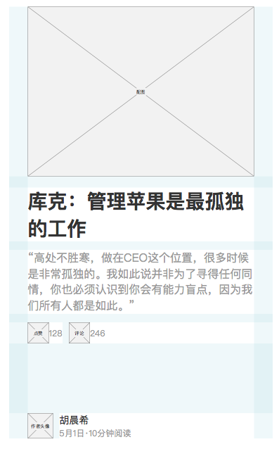

[返回文档目录](../)

# 20170504周刊APP迭代需求文档（ios3.0.8/android3.0.4）

## （一）APP、网站、分享页文章内容禁用复制

## （二）信息流及文章详情页内容样式微调

**1)** 时间显示方式调整：当年的时间显示规则为“XX月XX日”，非当年显示为“XXXX年XX月XX日”  

**2)** 浏览数据替换为阅读时长：按500字/分钟，以正文字数换算   

需调整的地方包括5处：

* 信息流中普通文章的时间及阅读时长数据展示  

  

* 信息流中杂志文章的时间及阅读时长数据展示  

  

* 信息流中专题推荐的阅读时长数据

  

* 专题文章列表的时间及阅读时长数据展示  

  

* 普通/专题/杂志文章详情页的时间及阅读时长数据展示  

  

**3)** 信息流专题推荐样式微调  

由于文章数已在专题标题下方显示，且目前互联网用户均有点击封面进入的列表的认知，所以删除信息多余的绿色按钮。

**4)** 专题文章列表样式微调  

专题文章列表的点赞和评论按钮，没有按设计稿跟在摘要下面。

## （三）多设备封禁限制增加到8台；同时可登陆设备数增加到4台

提示文案无需修改。

## （四）保留最后阅读位置  
APP进程关闭时（用户手动杀死APP，或手机自动结束进程），若当前页面为文章详情页，则下次启动app时自动打开之前文章，并跳转上次阅读位置。

## （五）收藏点赞合并

收藏点赞按钮合并为信息流和文章页的“心形”按钮。点亮心形按钮，收藏文章；熄灭心形按钮，取消收藏文章。无需“收藏成功”、“取消收藏”的提示。APP需要保证不会出现点亮但收藏不成功的情况。

同时，为了引导用户此改变，个人中心-我的收藏入口文案修改为“喜欢的文章”。

