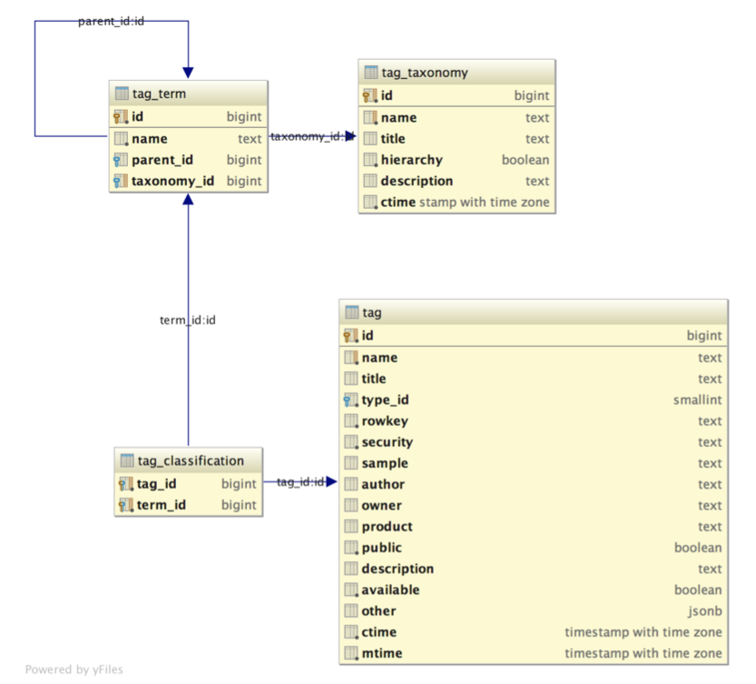

[返回文档目录](../)

## 目录
* [标签的形式分类](#标签的形式分类)
  * [从标签的组织形式上看](#从标签的组织形式上看)
  * [从标签的原子类型上看](#从标签的原子类型上看)
  * [从对整形原子类型的解释方法上看](#从对整形原子类型的解释方法上看)
  * [形式分类小结](#形式分类小结)
* [标签的内容分类](#标签的内容分类)
  * [标签动态分类体系的设计](#标签动态分类体系的设计)
  * [内容分类小结](#内容分类小结)

## 标签的形式分类
### 从标签的组织形式上看
* 通常意义的标签是单值标签，或称原子标签。其取值是一个独立的值。如 女，23，90.6 。
* 一部分标签是多值标签，多个原子标签整个作为一个整体形成一个标签，例如微博上人们用来描述自己的关键词列表：['90后','处女座','么么哒']。
* 还有一部分标签，为每个原子标签额外添加了一个权值参数。这也是很常见的需求，例如用来标识用户对逻辑上相关联的一组取值的频次频率值，预测概率等。
* 最后，为多值标签的每个原子标签添加关联权值就得到了权值标签。

&emsp;&emsp;结论：从标签的组织形式上看，标签可以分为四类：单值标签，单权标签，多值标签，多权标签。于是，我们就获得了两个基本正交的维度：是否为多值标签，是否带有权值。

### 从标签的原子类型上看
&emsp;&emsp;我们知道计算机的物理实现本质上只提供了整形与浮点两种原子数据类型。将指针，单字符，布尔，浮点都归入数值类型，将极其常用的字符数组看做字符串类型，那么逻辑上其实我们只有两种原子数据类型：即数值类型（Numeric）与字符串（String）。

&emsp;&emsp;结论：从标签的原子类型上看，标签可以分为整形，浮点，字符串。

### 从对整形原子类型的解释方法上看
&emsp;&emsp;枚举标签通常用一个整型标识标签取值，同时提供一个从整型值到字符串的字典，用于解释这个整型值。

&emsp;&emsp;所以，对于整型原子类型的解释方法，又可以成为一个标签分类的维度，即是否为枚举标签。

&emsp;&emsp;结论：该维度原子标签的取值有四种：枚举，整型，浮点，字符串。

### 形式分类小结
&emsp;&emsp;由上述可知，从标签的形式上，我们获得了两个大的，基本正交的分类维度：
* 组织形式：单值标签，单权标签，多值标签，多权标签
* 原子类型：枚举标签，整型标签，文本标签，浮点标签

&emsp;&emsp;除了浮点多权标签不是合理的组合之外，其他共计15种组合。即，标签从形式上可以分为15个类型。恰好可以用4个bit表示。

* 标签结构类型字段

| 结构 |  说明 |
|:---| :----------- |
| 单值标签 | 取值为单一原子类型相应值 |
| 单权标签 | 取值为单一原子类型及其权值，可以以分隔符值，数组或字典等形式实现 |
| 多值标签 | 取值为同种原子类型组成的列表 |
| 多权标签 | 取值为同种原子类型组成的字典，key只能为string或string(bigint) |

&emsp;&emsp;

* 标签原子类型字段

| 结构 |  说明 |
|:---| :----------- |
| 枚举标签 | 实际为Bigint类型，默认类型，需要对照类型字典解读 |
| 整形标签 | 整型数值原子标签 |
| 文本标签 | 字符串原子标签 |
| 浮点标签 | 浮点数数值原子标签 |

&emsp;&emsp;

* 标签形式分类样例表

| id | title | storage | sample |
|:---| :----------- | :----------- | :----------- |
|0|单值枚举|int|性别标签：1 {"0":"男", "1" :"女"}|
|1|单值整型|int|年龄：23|
|2|单值文本|text|喜爱小说：“百年孤独”|
|3|单值浮点|float|体重：60.13|
|4|单权枚举|json|预测性别：[1,0.99]|
|5|单权整型|json|预测年龄：[23,0.99]|
|6|单权文本|json|电视剧-喜爱度：["星际迷航",9.8]|
|7|单权浮点|json|预测体重：[60.13,0.78]|
|8|多值枚举|json|闹钟设置：[1,2,3,4,5]|
|9|多值整型|json|三维：[100,100,100]|
|10|多值文本|json|喜爱电视剧：["星际迷航","绝命毒师","是的，大臣！"]|
|11|多值浮点|json|月度消费记录：[6379.13,6378.24,6356,12]|
|12|多权枚举|json|浓重设置概率分布：{"1":0.98,"2":0.75,"3":0.75,"4":0.5,"5":0.3}|
|13|多权整型|json|幸运数字-喜爱度：{"7":0.32,"5":0.63}|
|14|多权文本|json|网站浏览偏好标签：{"问答类":0.55,"交友类":0.75}|

## 标签的内容分类
&emsp;&emsp;可以纯粹从标签的取值特性上分类，也可以标签的来源场景（移动端，PC端），标签的所有权（私有，内部，群组，公司），标签的规模，标签的依赖，标签的row ID类型（OneID，acookie，mobile，umid，etc...），或者前端展示时采用的层级类目等等很多维度上进行分类。

&emsp;&emsp;按内容分类的结果更适合作为描述字段而非放入类型字段。换句话说，与其把内容分类成为分类，倒不如称之为枚举属性更为合适。

&emsp;&emsp;按标签内容分类可以进一步细分为：按标签固有属性分类，和按认为用途分类。属于标签固有属性的，适合放入标签元数据表中，作为一个字段。而属于人为用途划分的，因为需求可能会频繁地发生变化，所以需要提供一种在不改变数据库Schema的前提下支持动态增添分类体系的机制来实现这一需求。本文建议采用类似WordPress的Taxonomy概念，为人为划分构建一个动态分类体系。

### 标签动态分类体系的设计
&emsp;&emsp;为了提供适应这种变化需求的灵活性，可以考虑构建一张分类体系表(tag_taxonomy)、一张分类项表(tag_term)、一张分类表(tag_classification)。动态的实现分类体系的增添。如果需要实现带有层次结构的分类体系，只需要在分类项中，为每个分类条目维护一个父条目的指针即可。

&emsp;&emsp;举个例子，如果我们需要动态添加一个“公私”分类。首先，需要在分类体系表里注册这种分类体系：“标签公私分类体系”。然后在分类项表中，添加“公有”，“私有”两个分类体系的具体取值条目。最后，在标签分类表中，将标签与分类具体取值相关联。

### 内容分类小结
&emsp;&emsp;对于标签的内容分类：
* 标签的固有性质适合作为标签表的字段出现
* 标签的人为分类是和使用动态分类体系通过外键引入
* Schema的设计如下：

